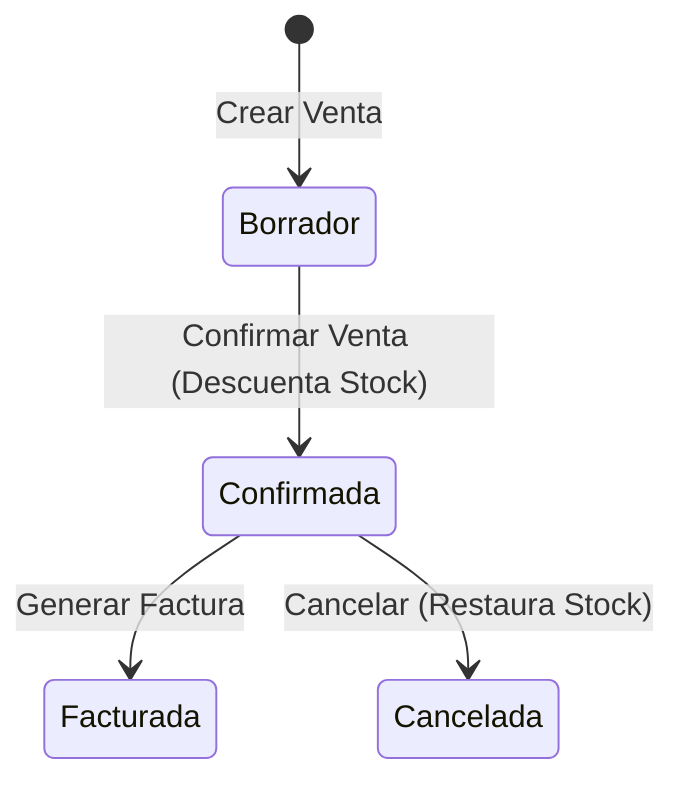

# Documentación Express - ERP Panadería "Delicias Dulces"

Este documento sintetiza de forma ejecutiva y técnica las funcionalidades principales de los **5 módulos** implementados en el sistema ERP Odoo para la gestión integral de la panadería.

---

## 1. Gestión de Inventario Básico

### Descripción General
Centraliza la administración del catálogo de productos y el control de existencias en almacén en tiempo real, garantizando la trazabilidad de los insumos y productos terminados.

### Funcionalidades Clave
* **Catálogo de Productos:** Registro detallado con atributos esenciales:
  * **Nombre del producto:** Identificador comercial único.
  * **Categoría:** Clasificación tipificada del producto.
  * **Precio de Venta y Costo:** Definición de costo unitario y precio al público, con cálculo automático del margen de ganancia.
* **Categorización Estructurada:** Organización predeterminada en 4 familias clave:
  * 🍞 **Pan**
  * 🎂 **Pastel**
  * 🍪 **Galleta**
  * 🥤 **Bebida**
* **Control de Stock Actual:** Monitoreo en tiempo real de las cantidades disponibles por producto.
* **Alerta Básica de Stock Mínimo:** Detección visual y lógica automática cuando el stock disponible es menor o igual al umbral mínimo establecido (`stock_minimo`), señalando la necesidad urgente de reposición.

---

## 2. Proceso de Ventas Esencial

### Descripción General
Gestiona el ciclo de vida de las transacciones comerciales de la panadería en mostrador o pedidos especiales, integrando la reserva y descuento inmediato de inventario.

### Funcionalidades Clave
* **Registro de Órdenes de Venta:** Creación ágil de pedidos vinculados a clientes con múltiples líneas de detalle (`lineas_ids`).
* **Cálculo Automático de Totales:**
  * Subtotal por línea (Cantidad × Precio Unitario).
  * Monto total acumulado de la venta calculado dinámicamente.
* **Actualización Automática de Stock:** Al confirmar la venta, se descuenta de forma automática e inmediata la cantidad vendida del inventario de cada producto.
* **Flujo de Estados:**
  * `Borrador`: Registro preliminar de la orden (permite modificaciones de cantidades y precios).
  * `Confirmada`: Aprobación final que bloquea la orden, descuenta el stock y habilita la facturación.

---

## 3. Registro de Clientes

### Descripción General
Extiende el modelo nativo de contactos y socios comerciales de Odoo (`res.partner`) para adaptarlo a las necesidades analíticas y comerciales de la panadería.

### Funcionalidades Clave
* **Extensión de `res.partner`:** Incorporación de metadatos especializados sin alterar la compatibilidad del ecosistema base de Odoo.
* **Campos Adicionales Especializados:**
  * `es_cliente_panaderia`: Indicador booleano para segmentar clientes específicos del negocio.
  * `fecha_registro`: Fecha y hora de alta del cliente en el sistema.
  * `total_compras`: Monto monetario histórico acumulado calculado automáticamente a partir de las ventas confirmadas.
* **Filtro y Vistas Personalizadas:** Filtro predeterminado en vistas de lista y kanban para consultar exclusivamente clientes de la panadería.

---

## 4. Facturación Simple

### Descripción General
Provee un mecanismo simplificado de emisión, seguimiento y cobranza de comprobantes fiscales/facturas asociadas a las órdenes de venta.

### Funcionalidades Clave
* **Generación Directa desde Venta:** Botón de acción en la orden de venta confirmada que transfiere automáticamente cliente, fecha, líneas y montos hacia una nueva factura.
* **Secuencia y Numeración Automática:** Asignación correlativa y única de folios de factura mediante secuencias internas de Odoo (ej. `FAC-2026-0001`).
* **Flujo y Gestión de Estados:**
  * `Pendiente`: Comprobante emitido a la espera del cobro.
  * `Pagada`: Registro de la recepción conforme del pago (efectivo, tarjeta o transferencia).
  * `Cancelada`: Anulación del comprobante en caso de rectificación o devolución.

---

## 5. Reportes Básicos

### Descripción General
Módulo analítico y de inteligencia operativa que consolida métricas clave para la toma de decisiones diarias de la gerencia.

### Funcionalidades Clave
* **Ventas del Día:**
  * Reporte consolidado de transacciones efectuadas en la jornada actual.
  * Agrupación por método de pago, vendedor y balance total facturado.
* **Productos Más Vendidos:**
  * Ranking (Top N) de productos con mayor volumen de unidades colocadas e ingresos generados.
  * Análisis de rotación de inventario por categoría.
* **Alerta de Stock Bajo:**
  * Listado consolidado de productos cuyas existencias están en o por debajo del stock mínimo.
  * Sugerencia automática de cantidades a reponer/producir en panadería.

---

## Matriz Resumen de Módulos y Modelos Técnicos

| # | Módulo Funcional | Modelo Odoo Principal | Modelos Relacionados | Salidas / Vistas Principales |
|---|---|---|---|---|
| **1** | **Inventario Básico** | `panaderia.producto` | `panaderia.categoria` | Catálogo de productos, alertas de stock mínimo |
| **2** | **Ventas Esencial** | `panaderia.venta` | `panaderia.venta.linea` | Formulario de venta, órdenes confirmadas |
| **3** | **Registro de Clientes** | `res.partner` (extendido) | `panaderia.venta` | Vista de clientes de panadería, métrica total compras |
| **4** | **Facturación Simple** | `panaderia.factura` | `panaderia.factura.linea`, `panaderia.venta` | Comprobante de pago, historial de facturas |
| **5** | **Reportes Básicos** | `panaderia.reporte` / Wizard | Modelos de Venta, Producto e Inventario | Reporte PDF de ventas diarias, tablero de stock bajo |
