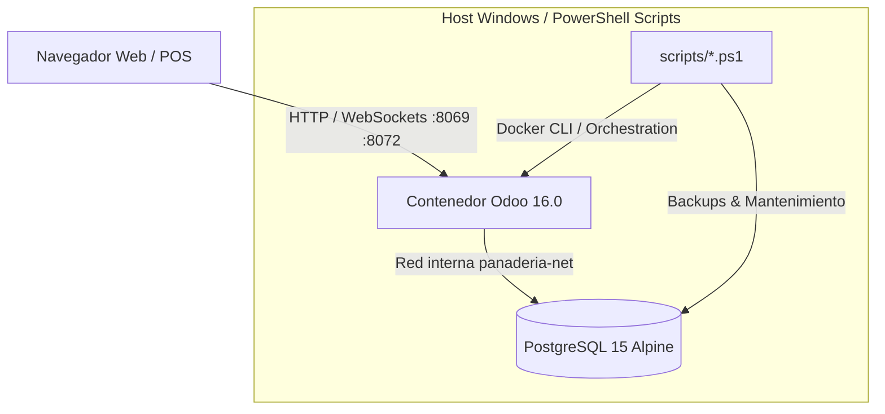

# 🥐 Panadería "Delicias Dulces" — Sistema ERP a Medida

<div align="center">


<p align="center">
  <strong>Solución integral de planificación de recursos empresariales (ERP) desarrollada sobre Odoo 16 para la administración, ventas, inventario y facturación electrónica tributaria (DTE) de panaderías y pastelerías.</strong>
</p>

[Características](#-características-principales) •
[Arquitectura](#-arquitectura-y-tecnologías) •
[Instalación Rápida](#-guía-de-instalación-y-despliegue) •
[Comandos DevOps](#-hoja-de-comandos-del-operador-powershell) •
[Estructura](#-estructura-del-proyecto) •
[Contribuidores](#-contribuidores)

</div>

---

## 📖 Descripción del Proyecto

**Panadería Delicias Dulces ERP** es un módulo a medida diseñado específicamente para responder a las dinámicas de venta ágil, producción diaria y control riguroso de inventario en panaderías y pastelerías artesanales e industriales. 

El sistema centraliza las operaciones del mostrador, la gestión de recetas/productos terminados, el aprovisionamiento de stock crítico y la emisión fiscal de **Documentos Tributarios Electrónicos (DTE - Factura Tipo 01)** conforme a los estándares de la República de El Salvador (Ministerio de Hacienda).

---

## ✨ Características Principales

El sistema se compone de **5 submódulos funcionales integrados**:

### 1. 🍞 Gestión de Inventario y Catálogo Especializado
- **Fichas de Producto Detalladas:** Costo unitario, precio de venta al público y cálculo dinámico de márgenes de ganancia (`margen_ganancia`).
- **Familias de Productos:** Clasificación tipificada en 4 familias predefinidas:
  - 🍞 **Pan** (salado, dulce, rústico, molde).
  - 🎂 **Pastel** (personalizado, tradicional, porciones).
  - 🍪 **Galleta** (por peso, empaque, individuales).
  - 🥤 **Bebida** (calientes, refrescos, lácteos).
- **Control de Stock Mínimo:** Detección visual automática cuando el stock disponible llega al umbral crítico (`stock <= stock_minimo`).
- **Ajustes de Inventario:** Registro y trazabilidad de mermas, consumos internos y regularizaciones físicas de existencias.

### 2. 🛒 Proceso de Ventas Esencial
- **Punto de Venta Ágil:** Creación rápida de órdenes de mostrador con múltiples líneas de producto y cálculo dinámico de subtotales e impuestos.
- **Descuento Inmediato de Stock:** Al validar y confirmar la orden, se deduce automáticamente la cantidad vendida del inventario en tiempo real.
- **Ciclo de Estados Robusto:**
  ```mermaid
  stateDiagram-v2
      direction LR
      [*] --> Borrador: Crear Venta
      Borrador --> Confirmada: Confirmar Venta (Descuenta Stock)
      Confirmada --> Facturada: Generar Factura DTE
      Confirmada --> Cancelada: Anular (Reversa Stock)
  ```

### 3. 👥 Registro y Fidelización de Clientes
- **Extensión Nativa de `res.partner`:** Conserva total compatibilidad con el ecosistema Odoo sin colisión de esquemas.
- **Campos Especializados:**
  - `es_cliente_panaderia`: Segmentación automática de clientes de mostrador y pedidos.
  - `total_compras`: Monto monetario histórico acumulado calculado automáticamente por compras confirmadas.
  - `fecha_registro`: Antigüedad del socio comercial.
- Vistas kanban y listas con filtros predeterminados para consultas rápidas.

### 4. 🧾 Facturación Simple y DTE (El Salvador - Factura Tipo 01)
- **Generación Automática:** Creación de factura vinculada inmediatamente tras la confirmación de la venta.
- **Normativa DTE El Salvador:**
  - **Código de Generación:** Identificador universal UUID v4 oficial en mayúsculas.
  - **Número de Control MH:** Formato legal estandarizado `DTE-01-M001P001-` con correlativo de 15 dígitos.
  - **Sello de Recepción Fiscal:** Firma criptográfica de 40 caracteres.
  - **Código QR Nativo:** Escaneable con URL directa de consulta ante el Ministerio de Hacienda.
  - **Total en Letras:** Traducción automática del monto total a palabras en español.
- **Reporte PDF QWeb:** Diseño corporativo con membrete oficial, desglose de IVA (13%), retenciones, ventas exentas/gravadas y botón de impresión en 1 clic.

### 5. 📊 Reportes Operativos y Analítica
- **Ventas del Día:** Resumen consolidado de transacciones, recaudación por jornada y segregación por medio de pago.
- **Top de Productos Más Vendidos:** Ranking por unidades vendidas e ingresos brutos generados.
- **Tablero de Reposición Urgente:** Consolidado de productos bajo el stock mínimo con sugerencia de producción para el maestro panadero.

---

## 🏛️ Arquitectura y Tecnologías



| Capa | Componente | Descripción |
|---|---|---|
| **Aplicación** | Odoo 16.0 Community | Motor de ERP modular extensible |
| **Base de Datos** | PostgreSQL 15 Alpine | Almacenamiento transaccional ACID con volumen dedicado (`panaderia_odoo_db_data`) |
| **Orquestación** | Docker Compose v2 | Despliegue reproducible con red aislada `panaderia-net` |
| **Lenguaje Core** | Python 3.10 | Lógica de modelos ORM, controladores y reportes QWeb |
| **Interfaz & Vistas** | XML / QWeb / CSS | Formularios limpios, vistas kanban y plantillas de impresión |
| **Automatización** | PowerShell 5.1 / 7+ | Scripts DevOps para ciclo de vida, backups, migraciones y healthchecks |

---

## 📂 Estructura del Proyecto

```plaintext
des-panaderia-erp/
├── .env.sample                 # Plantilla de variables de entorno seguras
├── docker-compose.yml          # Especificación oficial de servicios (web + db)
├── Documentacion_Express.md    # Resumen técnico y funcional de los 5 módulos
├── Instrucciones_Instalacion.txt # Manual operativo paso a paso
├── Modulo_Odoo/                # Código fuente del módulo Odoo 'panaderia'
│   ├── __manifest__.py         # Manifiesto y dependencias del módulo
│   ├── data/                   # Datos semilla XML (categorías, demo, secuencias)
│   ├── models/                 # Modelos ORM (producto, venta, factura, cliente, etc.)
│   ├── report/                 # Plantillas QWeb PDF (reporte diario, factura DTE)
│   ├── security/               # Reglas de acceso ir.model.access.csv y grupos
│   ├── static/                 # Recursos visuales (logos, css, imágenes)
│   └── views/                  # Vistas XML (formularios, árboles, kanban, menús)
├── backups/                    # Directorio de volcados SQL y semillas (.dump)
├── config/                     # Configuración de Odoo (odoo.conf generado)
├── docs/                       # Documentación adicional y procedimientos de prueba
└── scripts/                    # Herramientas de automatización en PowerShell
    ├── docker-start.ps1        # Arranque completo de un solo comando
    ├── docker-stop.ps1         # Detención de servicios
    ├── docker-restart.ps1      # Reinicio y actualización (-Upgrade) del módulo
    ├── healthcheck.ps1         # Diagnóstico de salud de contenedores y servicios
    ├── db-backup.ps1           # Respaldo de base de datos
    ├── db-restore.ps1          # Restauración controlada de volcados
    ├── db-init-seed.ps1        # Carga de datos de demostración
    ├── docker-logs.ps1         # Inspección de logs en tiempo real
    └── render-odoo-conf.ps1    # Generador seguro de configuración odoo.conf
```

---

## 🚀 Guía de Instalación y Despliegue

### Requisitos Previos
- **Sistema Operativo:** Windows 10/11 con **PowerShell 5.1** o **PowerShell 7+**.
- **Docker Desktop:** En ejecución con motor Linux y soporte para Docker Compose v2.
- **Git** instalado.

---

### Paso 1: Clonar el Repositorio
```powershell
git clone git@github.com:MrTobar04/des-panaderia-erp.git
cd des-panaderia-erp
```

### Paso 2: Habilitar Ejecución de Scripts (Una vez por sesión)
Windows restringe la ejecución de scripts por omisión. Ejecuta en PowerShell:
```powershell
Set-ExecutionPolicy -Scope Process -ExecutionPolicy Bypass
```
*(Si descargaste el proyecto como ZIP comprimido en lugar de clonar con git, ejecuta: `Get-ChildItem .\scripts\*.ps1 | Unblock-File`)*.

---

### Paso 3: Arranque de un Solo Comando
Lanza todo el ecosistema (PostgreSQL + Odoo + Configuración inicial) con:
```powershell
.\scripts\docker-start.ps1
```
Este script automatiza:
1. Creación automática de `.env` desde `.env.sample` (si no existía).
2. Generación segura de `config/odoo.conf` inyectando la clave maestra.
3. Despliegue e inicio de los contenedores Docker.
4. Sondeo de salud (*healthcheck*) hasta confirmar que los servicios responden con éxito.
5. Notificación del punto de entrada en navegador: **`http://localhost:8069`**.

---

### Paso 4: Cargar Semilla de Datos y Demostración
Para poblar la base de datos con el catálogo inicial, categorías, secuencias y transacciones de prueba:
```powershell
.\scripts\db-init-seed.ps1
```

---

### Paso 5: Ingreso al Sistema
Abre tu navegador e ingresa a:
- **URL:** [http://localhost:8069](http://localhost:8069)
- **Email / Usuario:** `admin` (o el configurado en tu archivo `.env`)
- **Contraseña:** Configurada en tu `.env` (`ODOO_ADMIN_PASSWD`)

---

## 🛠️ Hoja de Comandos del Operador (PowerShell)

| Acción | Comando | Descripción |
|---|---|---|
| **Iniciar entorno** | `.\scripts\docker-start.ps1` | Inicializa y valida la salud de la pila |
| **Detener entorno** | `.\scripts\docker-stop.ps1` | Detiene contenedores conservando los datos |
| **Reiniciar Odoo** | `.\scripts\docker-restart.ps1` | Reinicio rápido del servicio web |
| **Aplicar cambios Python** | `.\scripts\docker-restart.ps1 -Upgrade` | Reinicia y actualiza el módulo `panaderia` |
| **Diagnóstico de salud** | `.\scripts\healthcheck.ps1` | Revisa estado de contenedores, puertos y PostgreSQL |
| **Ver logs en vivo** | `.\scripts\docker-logs.ps1 -Follow` | Muestra el streaming de registros de Odoo |
| **Respaldar BD** | `.\scripts\db-backup.ps1` | Genera un volcado `.dump` en la carpeta `backups/` |
| **Restaurar BD** | `.\scripts\db-restore.ps1 -BackupFile .\backups\seed_demo.dump` | Restaura un respaldo específico |
| **Regenerar config** | `.\scripts\render-odoo-conf.ps1` | Vuelve a renderizar `config/odoo.conf` |

> [!WARNING]
> **No ejecutes `docker compose down -v`**: Esta acción destruye los volúmenes persistentes y la base de datos de PostgreSQL. Si requieres un reinicio limpio, utiliza `.\scripts\docker-stop.ps1 -RemoveVolumes` confirmando la palabra de seguridad `BORRAR`.

---

## 👥 Contribuidores

Este proyecto ha sido desarrollado e implementado por:

<div align="center">
<table>
  <tr>
    <td align="center" width="200">
      <a href="https://github.com/MrTobar04">
        <br />
        <sub><b>MrTobar04</b></sub>
      </a><br />
      <a href="https://github.com/MrTobar04" title="Perfil de GitHub">💻 Core Developer & Arquitectura ERP</a>
    </td>
    <td align="center" width="200">
      <a href="https://github.com/AleH14">
        <br />
        <sub><b>AleH14</b></sub>
      </a><br />
      <a href="https://github.com/AleH14" title="Perfil de GitHub">💻 Core Developer & Procesos de Negocio</a>
    </td>
  </tr>
</table>
</div>

---

## 📄 Licencia

Este proyecto está bajo la Licencia **LGPL-3.0** (*GNU Lesser General Public License v3.0*). Consulta el manifiesto de la aplicación para más detalles.

---

<div align="center">
  <sub>Desarrollado con dedicación para <strong>Panadería Delicias Dulces</strong> 🥖🍰</sub>
</div>
