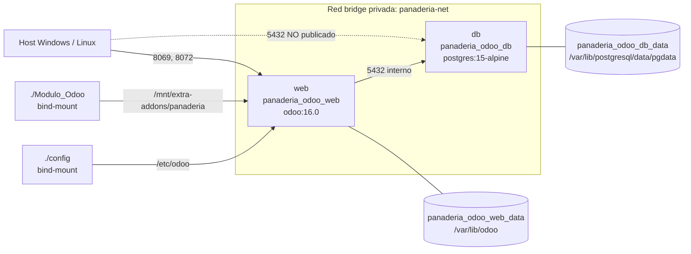

# Implementation Plan: Aprovisionamiento de Entorno Local en Docker

**Branch**: `0.1.1-local-docker-environment` | **Date**: 2026-09-29 | **Spec**: [`spec.md`](./spec.md)

**Input**: Feature specification from `specs/0-infrastructure/0.1-docker-provisioning/0.1.1-local-docker-environment/spec.md`

---

## Summary

Provision the Capa 0 container substrate for the Panadería "Delicias Dulces" ERP: a Docker Compose v2 stack composed of a PostgreSQL 15 Alpine service (`db`) and an Odoo 16.0 service (`web`), joined by a private bridge network (`panaderia-net`), backed by two named volumes for the PostgreSQL datadir and the Odoo filestore, and fed by a live bind-mount of the custom addon (`./Modulo_Odoo`) so module iteration requires no image rebuild. All credentials are parameterized through `.env`, which is excluded from version control; `.env.sample` is the committed, non-secret template. This feature delivers the deterministic single-command startup (`docker compose up -d`) mandated by Constitution Principle VI, and is the root dependency for `SPEC-0.1.2`, `SPEC-0.2.1`, and `SPEC-0.3.1`.

---

## Technical Context

**Language/Version**: Declarative YAML (Compose Specification, as implemented by Docker Compose v2.20+). No application code is authored in this feature.

**Primary Dependencies**: Docker Engine 24+ with the bundled Compose v2 plugin; official upstream images `postgres:15-alpine` and `odoo:16.0`.

**Storage**: Two Docker named volumes — `panaderia_odoo_db_data` (PostgreSQL datadir at `/var/lib/postgresql/data/pgdata`) and `panaderia_odoo_web_data` (Odoo filestore and sessions at `/var/lib/odoo`). One bind-mount for live addon source, one bind-mount for server configuration.

**Testing**: Declarative validation via `docker compose config`; runtime validation via container healthchecks (`pg_isready` for `db`, HTTP probe on `/web/login` for `web`) and the manual procedure recorded in `docs/test-procedures/test-procedure-0.1.1.md`.

**Target Platform**: Windows 10/11 with Docker Desktop on the WSL2 backend (primary development and demo host) and Linux with native Docker Engine (parity target).

**Project Type**: Infrastructure-as-code / local container orchestration. No `src/` tree, no compiled artifacts.

**Performance Goals**: Cold start (empty volumes) to a responding `http://localhost:8069` in under 90 seconds. Warm start (populated volumes) in under 20 seconds. `db` reaches `healthy` within 25 seconds (5s interval × 5 retries).

**Constraints**:
- PostgreSQL port `5432` must not be published to the host in the default configuration (`SPEC-0.1.1` §3, Acceptance Scenario 3).
- No credential, master key, or password may enter Git history (Constitution Principle VI, ISO-27001 secret management).
- Data must survive `docker compose down` followed by `docker compose up -d` with zero loss (Acceptance Scenario 2).
- Host port `8069` must be reassignable without editing tracked files, via `.env` only (`SPEC-0.1.1` §8).
- Paths and volume mounts must resolve identically on Windows (WSL2) and Linux.

**Scale/Scope**: 1 Compose file, 2 services, 1 network, 2 named volumes, 2 bind-mounts, 1 environment template with 8 variables, 1 `.gitignore` amendment. Single-node, single-developer local footprint; no replication, no clustering.

---

## Constitution Check

*GATE: Evaluated against Constitution v1.1.0 before Phase 0 research and re-verified after Phase 1 design.*

| Principle / Rule | Compliance Status | Justification / Implementation Reference |
| :--- | :--- | :--- |
| **I. Odoo Modular Architecture & MVC Separation** | **PASS** | No Odoo source is modified. The stack mounts `./Modulo_Odoo` read-write so the module keeps its own MVC structure; core Odoo addons remain untouched inside the image. |
| **II. Atomic Sales-to-Inventory Synchronization** | **N/A** | No business logic in this layer. The plan does guarantee a single, transactional PostgreSQL instance so atomicity is achievable by Capa 1–5 features. |
| **III. Proactive Stock Alerting & Data Integrity** | **PASS (enabling)** | Durable named volume for the PostgreSQL datadir plus a `pg_isready` healthcheck gate (`depends_on: service_healthy`) prevents Odoo from starting against a half-initialized database, which is the main source of corrupt first-run state. |
| **IV. Spec-Driven Verification & Traceable Test Procedures** | **PASS** | Every acceptance scenario in `spec.md` §5 maps to a numbered step in [`quickstart.md`](./quickstart.md), which is the source for `docs/test-procedures/test-procedure-0.1.1.md`. |
| **V. Operational Usability & Express Deployment Standards** | **PASS** | Single-command startup, readable fixed container names (`panaderia_odoo_web`, `panaderia_odoo_db`) for log filtering, and an `.env.sample` that works unmodified except for the password. |
| **VI. Deterministic Local Docker Provisioning & Environment Parity** | **PASS** | This feature *is* the implementation of Principle VI: decoupled `web`/`db` services, named volumes `odoo-web-data` / `odoo-db-data`, live addon mount at `/mnt/extra-addons/`, `.env` parameterization, and `.gitignore` exclusion. |
| **Technical Stack §2 — Compose v2, healthchecks, `restart: unless-stopped`** | **PASS** | Compose Specification syntax, `pg_isready` healthcheck on `db`, HTTP healthcheck on `web`, `restart: unless-stopped` on both services. |
| **Technical Stack §5 — Delivery Directory Layout** | **PASS** | `docker-compose.yml`, `.env.sample`, `.gitignore`, and `config/` land at the repository root exactly as the Constitution's tree prescribes. |

**Gate result**: PASS. Two naming deviations and two additive hardening measures are recorded in [Complexity Tracking](#complexity-tracking); none violates a principle.

---

## Project Structure

### Documentation (this feature)

```text
specs/0-infrastructure/0.1-docker-provisioning/0.1.1-local-docker-environment/
├── spec.md                                  # Feature specification
├── plan.md                                  # Implementation plan (this file)
├── research.md                              # Phase 0 decisions & rejected alternatives
├── quickstart.md                            # Phase 1 startup & verification guide
├── contracts/                               # Phase 1 contracts
│   ├── compose-topology-contract.md         # Services, network, volumes, mounts, healthchecks
│   └── environment-variables-contract.md    # .env / .env.sample variable surface
└── checklists/
    └── requirements.md                      # Specification quality checklist (pre-existing)
```

> `data-model.md` is intentionally absent: this feature defines no ORM entities, fields, or relations. Its structural contract is the Compose topology, captured in `contracts/compose-topology-contract.md`.

### Source Code (repository root)

```text
des-panaderia-erp/
├── docker-compose.yml           # NEW — stack definition (this feature)
├── .env.sample                  # NEW — committed, non-secret template (this feature)
├── .env                         # NEW, UNTRACKED — generated from .env.sample
├── .gitignore                   # AMEND — confirm .env exclusion, add config/odoo.conf
├── config/                      # Consumed here as a bind-mount; authored by SPEC-0.1.2
│   └── odoo.conf.template
└── Modulo_Odoo/                 # EXISTING — bind-mounted live at /mnt/extra-addons/panaderia
    ├── __manifest__.py
    ├── models/
    ├── views/
    ├── data/
    ├── security/
    └── tests/
```

**Structure Decision**: Repository-root infrastructure layout, matching Constitution §5 (Delivery Directory Layout) verbatim. The Compose file stays at the root so `docker compose` resolves the project directory, the `.env` file, and both relative bind-mount sources with no `-f` or `--project-directory` flags — a prerequisite for the "single-command startup" requirement. The `config/` directory is created by this feature only as a mount point; its contents are owned by `SPEC-0.1.2`.

### Container Topology



---

## Implementation Phases

### Phase 0 — Research (complete)

Technical unknowns resolved in [`research.md`](./research.md): Compose schema version handling, `addons_path` versus bind-mount target semantics, `PGDATA` subdirectory placement, PostgreSQL isolation verification method, `web` readiness probing without `curl` in the Odoo image, and Windows/Linux bind-mount parity.

### Phase 1 — Design & Contracts (complete)

1. [`contracts/compose-topology-contract.md`](./contracts/compose-topology-contract.md) — normative service, network, volume, mount, port, and healthcheck definitions. This is the authority that `SPEC-0.1.2`, `SPEC-0.2.1`, and `SPEC-0.3.1` consume for container names and paths.
2. [`contracts/environment-variables-contract.md`](./contracts/environment-variables-contract.md) — every `.env` variable, its default, its consumer, and whether it is a secret.
3. [`quickstart.md`](./quickstart.md) — executable verification path covering all three acceptance scenarios.

### Phase 2 — Tasks (not produced by this command)

`/speckit-tasks` will decompose this plan into `tasks.md`. Expected task groups, in dependency order:

| Order | Task Group | Produces |
| :--- | :--- | :--- |
| 1 | Environment template | `.env.sample` with all 8 variables |
| 2 | `.gitignore` hardening | Verified `.env` exclusion, `config/odoo.conf` exclusion, `backups/` rules |
| 3 | Compose topology | `docker-compose.yml` (networks, volumes, `db`, `web`) |
| 4 | Static validation | `docker compose config` passes with no warnings |
| 5 | Runtime validation | `db` healthy, `web` serving HTTP, `5432` unreachable from host |
| 6 | Persistence validation | Data survives a `down` / `up -d` cycle |
| 7 | Test procedure | `docs/test-procedures/test-procedure-0.1.1.md` |

---

## Traceability: Acceptance Criteria → Design

| Spec Scenario | Design Element | Verification |
| :--- | :--- | :--- |
| **1 — Successful stack startup** | `depends_on: db: condition: service_healthy`; `pg_isready` healthcheck; published `8069`/`8072` | `quickstart.md` §3, §4 |
| **2 — Resume after forced shutdown** | Named volumes `panaderia_odoo_db_data` and `panaderia_odoo_web_data`; `PGDATA` pinned to a subdirectory of the volume | `quickstart.md` §5 |
| **3 — PostgreSQL isolation** | `db` declares no `ports:` key; reachable only via service DNS `db:5432` on `panaderia-net` | `quickstart.md` §6 |
| **§8 Risk — port 8069 collision** | `"${ODOO_HTTP_PORT:-8069}:8069"` indirection | `quickstart.md` §7 |
| **§7 — ISO-27001 secret management** | `.env` in `.gitignore`; `.env.sample` placeholders suffixed `_change_me` | `quickstart.md` §8 |

---

## Complexity Tracking

> Constitution Check passed. The entries below record deliberate deviations from the literal text of `spec.md` §4 and two additive hardening measures. Each is justified; none introduces new runtime components.

| # | Deviation / Addition | Why Needed | Simpler Alternative Rejected Because |
| :--- | :--- | :--- | :--- |
| 1 | **Omit the top-level `version: '3.8'` key** present in `spec.md` §4. | Compose v2 ignores `version` and emits `the attribute 'version' is obsolete` on every invocation. A clean `docker compose config` run is a DoD item. | Keeping the key satisfies the spec text literally but produces a permanent warning that trains the operator to ignore Compose output during the demo. |
| 2 | **`addons_path` targets `/mnt/extra-addons`, not `/mnt/extra-addons/panaderia`.** The bind-mount target stays `/mnt/extra-addons/panaderia` exactly as specified; the module's technical name therefore becomes `panaderia`. | Odoo scans each `addons_path` entry for *child* directories containing `__manifest__.py`. Pointing it at `/mnt/extra-addons/panaderia` makes Odoo scan inside the module and find only `models/`, `views/`, `security/` — the addon is never discovered, breaking `SPEC-0.1.2` Acceptance Scenario 1. | Mounting at `/mnt/extra-addons/Modulo_Odoo` also works but yields the technical name `Modulo_Odoo`, which is not a valid Odoo module identifier (capitals and mixed case break `-u`/`-i` invocations and the `odoo.addons.*` log namespace). |
| 3 | **Additive: HTTP healthcheck on the `web` service** using the image's bundled `python3`. | Lets `SPEC-0.3.1`'s `docker-start.ps1` poll a real readiness signal instead of the fragile fixed `Start-Sleep -Seconds 5`, and makes `docker compose ps` self-explanatory during the defense. | A fixed sleep is simpler but non-deterministic: Odoo cold-start on Windows/WSL2 regularly exceeds 5 seconds, producing a false failure in front of the evaluator. |
| 4 | **Additive: `.env.sample` carries `ODOO_ADMIN_PASSWD` and `ODOO_DB_NAME`** beyond the six variables listed in `spec.md` §4. | `SPEC-0.1.2` needs the master password injected at runtime rather than committed, and `SPEC-0.2.1`'s backup/restore scripts need a single authoritative database name. Centralizing them here keeps one secret surface. | Hardcoding the master password in `config/odoo.conf` is simpler but commits a credential to Git, violating Principle VI and ISO-27001. |
| 5 | **Network named `panaderia-net`**, per `spec.md`, rather than `panaderia-network` from Constitution Technical Stack §2. | `spec.md` is the more specific artifact and is already referenced by the sibling Capa 0 specs. Constitution Principle VI (the normative clause) does not name the network. | Renaming to `panaderia-network` would desynchronize `spec.md`, its checklist, and the three dependent specs for no functional gain. **Follow-up:** raise a Constitution PATCH to align Technical Stack §2 wording with Principle VI (which also disagrees with §2 on volume names). |

---

## Known Cross-Artifact Inconsistencies (for `/speckit-analyze`)

Recorded here rather than silently fixed, because they touch artifacts outside this feature's scope:

1. **Constitution internal conflict** — Principle VI names the volumes `odoo-web-data` / `odoo-db-data` and Technical Stack §2 names them `web_data` / `db_data`; §2 also says `panaderia-network` while Principle VI is silent. This plan follows Principle VI plus `spec.md`.
2. **`SPEC-1.1.1` quickstart drift** — `specs/1-inventory/.../quickstart.md` invokes `docker compose exec odoo …` and `-u panaderia_delicias_dulces`. Under this contract the service is `web` and the module technical name is `panaderia`, so those commands become `docker compose exec web odoo -u panaderia -d panaderia_db --stop-after-init`. That file needs a follow-up correction.
3. **Stale absolute links** — existing Capa 1 artifacts link with `file:///d:/UDB/...` URIs from a different machine and resolve nowhere in this checkout. All Capa 0 artifacts use repository-relative links instead.
