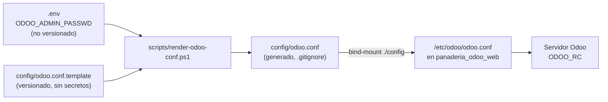

# Implementation Plan: Configuración del Servidor Odoo y Modos de Desarrollo

**Branch**: `0.1.2-odoo-server-configuration` | **Date**: 2026-09-29 | **Spec**: [`spec.md`](./spec.md)

**Input**: Feature specification from `specs/0-infrastructure/0.1-docker-provisioning/0.1.2-odoo-server-configuration/spec.md`

---

## Summary

Author the Odoo server configuration consumed by the `web` container at `/etc/odoo/odoo.conf`: the addons search path that makes the bakery module discoverable, the filestore location, the master password guarding the database manager, developer hot-reload modes, per-module log verbosity, and resource limits. Two design corrections are central. First, `addons_path` must reference `/mnt/extra-addons` — the **parent** of the bind-mount target — because Odoo enumerates the children of each path entry; the value written in `spec.md` §4 makes the module permanently undiscoverable. Second, the master password is a secret and cannot live in a tracked file, so `config/odoo.conf` is generated at startup from a committed `config/odoo.conf.template` with `ODOO_ADMIN_PASSWD` injected from `.env` — the "runtime secret injection" the Constitution requires in Technical Stack §2.

---

## Technical Context

**Language/Version**: INI configuration format as parsed by Python's `configparser`, under the `[options]` section. Compatible with Odoo 16.0 / 17.0 / 18.0.

**Primary Dependencies**: The `odoo:16.0` image's entrypoint and `odoo/tools/config.py` parser. A small PowerShell renderer (`scripts/render-odoo-conf.ps1`) for token substitution.

**Storage**: `data_dir = /var/lib/odoo`, backed by the `panaderia_odoo_web_data` named volume declared in `SPEC-0.1.1`. No database schema is touched by this feature.

**Testing**: Startup log assertions (`addons_path` contents, module discovery, per-module DEBUG lines), database-manager authentication behavior, and XML hot-reload observation. Recorded in `docs/test-procedures/test-procedure-0.1.2.md`.

**Target Platform**: The `web` container (`panaderia_odoo_web`) on `panaderia-net`, per the topology contract of `SPEC-0.1.1`.

**Project Type**: Infrastructure configuration-as-code. One template, one rendered artifact, one render script.

**Performance Goals**: Configuration parsing adds no measurable startup cost. XML view changes must be visible after a browser reload without restarting the container. Python model changes must be applied by a module upgrade in under 30 seconds.

**Constraints**:
- Standard INI syntax, single `[options]` section (`spec.md` §3).
- The master password must not be the weak default `admin` (`spec.md` §3) and must not be committed (Constitution Principle VI).
- `addons_path` must include the core addons directory; omitting it breaks the `base` module and the server will not boot.
- Configuration must be injected by bind-mount only — no custom image, no `Dockerfile`.

**Scale/Scope**: 1 committed template with 12 `[options]` keys, 1 generated file, 1 render script, 1 `.gitignore` amendment.

---

## Constitution Check

*GATE: Evaluated against Constitution v1.1.0 before Phase 0 research and re-verified after Phase 1 design.*

| Principle / Rule | Compliance Status | Justification / Implementation Reference |
| :--- | :--- | :--- |
| **I. Odoo Modular Architecture & MVC Separation** | **PASS** | `addons_path` places `/mnt/extra-addons` ahead of the core path, so `Modulo_Odoo` is loaded as the standalone module `panaderia` with zero modification to core addons. |
| **II. Atomic Sales-to-Inventory Synchronization** | **N/A** | No business logic. `workers = 0` (threaded mode) is retained, which keeps Capa 1–5 transactions in a single process and removes cross-worker race conditions during the demo. |
| **III. Proactive Stock Alerting & Data Integrity** | **N/A** | No validation logic in this layer. |
| **IV. Spec-Driven Verification & Traceable Test Procedures** | **PASS** | All three acceptance scenarios in `spec.md` §5 map to numbered steps in [`quickstart.md`](./quickstart.md), the source for `docs/test-procedures/test-procedure-0.1.2.md`. |
| **V. Operational Usability & Express Deployment Standards** | **PASS** | `dev_mode` gives XML hot reload so view iteration needs no restart; `log_handler` raises only the bakery module to DEBUG, keeping the log readable during the defense. |
| **VI. Deterministic Local Docker Provisioning & Environment Parity** | **PASS** | Config injected purely by bind-mount; the one secret (`admin_passwd`) is injected at runtime from `.env` and the rendered file is `.gitignore`d. |
| **Technical Stack §2 — "Centralized `config/odoo.conf` file and `.env.sample` template with runtime secret injection"** | **PASS** | This clause is the explicit authority for the template-plus-render design in [Complexity Tracking](#complexity-tracking) #2. |

**Gate result**: PASS. Three deviations from the literal text of `spec.md` §4 are recorded and justified below; each corrects a defect that would otherwise fail one of the spec's own acceptance scenarios.

---

## Project Structure

### Documentation (this feature)

```text
specs/0-infrastructure/0.1-docker-provisioning/0.1.2-odoo-server-configuration/
├── spec.md                                # Feature specification
├── plan.md                                # Implementation plan (this file)
├── research.md                            # Phase 0 decisions & rejected alternatives
├── quickstart.md                          # Phase 1 configuration & verification guide
├── contracts/                             # Phase 1 contracts
│   ├── odoo-conf-contract.md              # Normative [options] key-by-key contract
│   └── config-rendering-contract.md       # Template → rendered file → mount pipeline
└── checklists/
    └── requirements.md                    # Specification quality checklist (pre-existing)
```

> `data-model.md` is intentionally absent: this feature defines no ORM entities. Its structural contract is the INI key surface, captured in `contracts/odoo-conf-contract.md`.

### Source Code (repository root)

```text
des-panaderia-erp/
├── config/
│   ├── odoo.conf.template       # NEW, TRACKED — config-as-code with ${ODOO_ADMIN_PASSWD} token
│   └── odoo.conf                # NEW, UNTRACKED — rendered at startup, mounted into the container
├── scripts/
│   └── render-odoo-conf.ps1     # NEW — token substitution from .env (invoked by SPEC-0.3.1)
├── .gitignore                   # AMEND — add config/odoo.conf, keep the .template tracked
└── docker-compose.yml           # EXISTING (SPEC-0.1.1) — mounts ./config → /etc/odoo
```

**Structure Decision**: The whole `./config` directory is bind-mounted to `/etc/odoo`, so both the template and the rendered file are visible inside the container; only `odoo.conf` is read, because the image sets `ODOO_RC=/etc/odoo/odoo.conf`. Keeping the renderer in `scripts/` co-locates it with the lifecycle automation of `SPEC-0.3.1`, which calls it before `docker compose up -d`.

### Configuration Injection Pipeline



---

## Implementation Phases

### Phase 0 — Research (complete)

Resolved in [`research.md`](./research.md): `addons_path` enumeration semantics and the core-addons path for the Debian-packaged image; why `db_host`/`db_user`/`db_password` must be **omitted** from the config file; how Odoo actually validates `admin_passwd` and why the pseudo-hash in `spec.md` §4 breaks the database manager; which `dev_mode` flags are effective and which silently degrade; and why the resource limits are inert under `workers = 0`.

### Phase 1 — Design & Contracts (complete)

1. [`contracts/odoo-conf-contract.md`](./contracts/odoo-conf-contract.md) — every `[options]` key, its normative value, its effect, and its verification command.
2. [`contracts/config-rendering-contract.md`](./contracts/config-rendering-contract.md) — the template token surface, renderer behavior, idempotency and failure modes.
3. [`quickstart.md`](./quickstart.md) — verification path covering all three acceptance scenarios.

### Phase 2 — Tasks (not produced by this command)

| Order | Task Group | Produces |
| :--- | :--- | :--- |
| 1 | Config template | `config/odoo.conf.template` with all 12 keys and the single secret token |
| 2 | Renderer | `scripts/render-odoo-conf.ps1` with missing-variable and missing-template guards |
| 3 | `.gitignore` | `config/odoo.conf` excluded, `config/odoo.conf.template` retained |
| 4 | Mount verification | `/etc/odoo/odoo.conf` present and read inside `panaderia_odoo_web` |
| 5 | Discovery verification | `panaderia` listed in **Aplicaciones**, installable |
| 6 | Master-password verification | Database manager rejects an empty or wrong key |
| 7 | Hot-reload & log verification | XML change visible on reload; `odoo.addons.panaderia` DEBUG lines present |
| 8 | Test procedure | `docs/test-procedures/test-procedure-0.1.2.md` |

---

## Traceability: Acceptance Criteria → Design

| Spec Scenario | Design Element | Verification |
| :--- | :--- | :--- |
| **1 — Automatic bakery module detection** | `addons_path = /mnt/extra-addons,/usr/lib/python3/dist-packages/odoo/addons` (parent of the mount target) | `quickstart.md` §4 |
| **2 — Database manager protection** | `admin_passwd` rendered from `ODOO_ADMIN_PASSWD`; high entropy; plaintext accepted and self-upgraded to pbkdf2 by Odoo | `quickstart.md` §5 |
| **3 — Custom debug log visibility under `odoo.addons.panaderia`** | `log_handler = :INFO,odoo.addons.panaderia:DEBUG` — namespace derived from the technical name `panaderia` | `quickstart.md` §6 |
| **§4 UI/UX — XML changes visible on browser reload** | `dev_mode = reload,qweb,xml` | `quickstart.md` §7 |
| **§7 — Master key of high entropy, restricted file permissions** | Secret sourced from `.env`; rendered file untracked | `quickstart.md` §8 |
| **§8 Risk — `Modulo_Odoo` not mounted** | Renderer and `docker-start.ps1` assert `./Modulo_Odoo/__manifest__.py` exists before `up -d` | `quickstart.md` §3 |

---

## Complexity Tracking

> Constitution Check passed. Each entry corrects a defect in the literal configuration of `spec.md` §4 or resolves a contradiction inside that spec. None adds a runtime component.

| # | Deviation | Why Needed | Simpler Alternative Rejected Because |
| :--- | :--- | :--- | :--- |
| 1 | **`addons_path = /mnt/extra-addons,...`** instead of the specified `/mnt/extra-addons/panaderia,...`. | Odoo enumerates the *children* of each `addons_path` entry looking for `__manifest__.py`. Pointing at the module directory makes Odoo scan `models/`, `views/`, `security/` and find no module at all — **Acceptance Scenario 1 of this very spec fails deterministically.** The corrected value yields the technical name `panaderia`, which is also exactly what Scenario 3 asserts for the log namespace. | Changing the bind-mount target instead (e.g. `/mnt/extra-addons/Modulo_Odoo`) works mechanically but produces the technical name `Modulo_Odoo` — mixed case with a capital, which is invalid by Odoo module naming convention and awkward in `-u`, `--test-tags`, and logger names. |
| 2 | **`config/odoo.conf` is generated from a tracked `config/odoo.conf.template`** rather than committed directly as §9 lists it. | `admin_passwd` is a credential. Committing it violates Constitution Principle VI and ISO-27001. Constitution Technical Stack §2 explicitly prescribes "`.env.sample` template with **runtime secret injection**", which is precisely this pipeline. Config-as-code is preserved: every non-secret key stays in Git. | Committing `odoo.conf` with a real password leaks a credential. Committing it with a placeholder means the stack ships broken. Setting the master password through the Odoo UI makes Odoo rewrite a *tracked* file, leaving a permanently dirty working tree. |
| 3 | **`admin_passwd` is rendered as plaintext**, not as the pseudo-hash `$pbkdf2-sha512$25000$local_bakery_erp_master_pwd` from §4. | That string is not a valid pbkdf2-sha512 hash — the salt and checksum fields are absent. Odoo detects the `$pbkdf2-sha512$` prefix and hands it to passlib, which raises on the malformed payload, producing a `500` in the database manager instead of an authentication prompt. Odoo accepts a plaintext `admin_passwd` and transparently upgrades it to a real pbkdf2 hash on first successful verification. | Generating a genuine pbkdf2 hash locally also works, but it still commits a credential derivative and adds a hashing step to the setup path for no security gain in a local-only stack. |
| 4 | **`dev_mode = reload,qweb,xml`**, resolving this spec's internal disagreement (§2.1 says `reload,qweb,werkzeug`; §4 says `reload,qweb`). | `xml` is the flag that actually delivers the §4 UI/UX promise of XML views refreshing on browser reload. `werkzeug` is deliberately excluded: it renders full Python tracebacks into HTTP responses, which is a needless information-disclosure surface. | Keeping `werkzeug` matches §2.1's wording but weakens the security posture; dropping `xml` matches §4's wording but silently fails the hot-reload requirement. |
| 5 | **`db_host`, `db_user`, `db_password` are deliberately omitted** from the config file. | The official image entrypoint only injects `HOST`/`USER`/`PASSWORD` as CLI arguments when the corresponding key is *absent* from `ODOO_RC`; if present, the file wins. Omitting them keeps the Compose-supplied credentials authoritative and leaves `admin_passwd` as the file's only secret. | Writing them into `odoo.conf` would duplicate the database credentials into a second file, doubling the secret surface and creating a silent drift risk against `.env`. |

---

## Known Cross-Artifact Inconsistencies (for `/speckit-analyze`)

1. **`spec.md` §4 contradicts its own §5 Scenario 3** — the snippet writes `log_handler = ...odoo.addons.Modulo_Odoo:DEBUG` while Scenario 3 asserts the prefix `odoo.addons.panaderia`. Resolved by Complexity Tracking #1: the technical name is `panaderia`, so Scenario 3 stands and the snippet is corrected.
2. **`spec.md` §2.1 contradicts its own §4** on `dev_mode`. Resolved by Complexity Tracking #4.
3. **`spec.md` §9 lists `config/odoo.conf` as the deliverable** while §7 demands the master key not be weak and the Constitution forbids committing it. Resolved by Complexity Tracking #2: the tracked deliverable becomes `config/odoo.conf.template`.
4. **Resource limits are inert** — `limit_memory_hard`, `limit_memory_soft`, `limit_time_cpu`, and `limit_time_real` are enforced by Odoo's prefork server only. This stack runs threaded (`workers = 0`), so the keys are retained as declared intent and documented as non-enforcing rather than removed.
