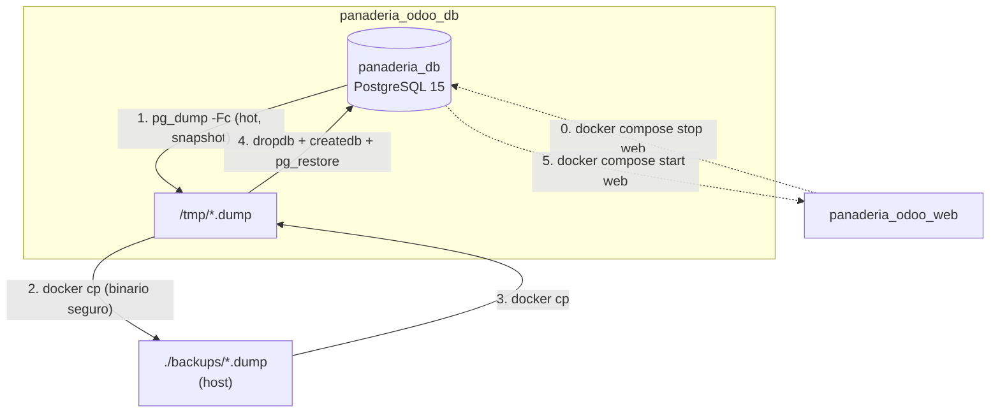

# Implementation Plan: Persistencia, Semillas y Respaldos de Base de Datos PostgreSQL

**Branch**: `0.2.1-db-persistence-and-backups` | **Date**: 2026-09-29 | **Spec**: [`spec.md`](./spec.md)

**Input**: Feature specification from `specs/0-infrastructure/0.2-database-management/0.2.1-db-persistence-and-backups/spec.md`

---

## Summary

Deliver the data-durability and state-reset tooling for the Panadería "Delicias Dulces" ERP: durable PostgreSQL persistence on the `panaderia_odoo_db_data` named volume, plus three PowerShell scripts that take a hot logical backup, restore it deterministically, and seed a demonstration database. The operational purpose is narrow and concrete — freeze a known-good state before the 10–12 minute defense and recover it in seconds if the live demo goes wrong.

Three corrections to the scripts in `spec.md` §4 are central to this plan. The dumps must target the Odoo business database (`panaderia_db`), not the `postgres` maintenance database that the spec's commands name — as written, every backup would be an empty shell. The restore must stop the `web` container rather than merely terminate sessions, because Odoo's connection pool reconnects instantly and wins the race against `pg_terminate_backend`. And the restore must create the target database when it is absent, which is exactly the fresh-clone case the versioned `seed_demo.dump` exists to serve.

---

## Technical Context

**Language/Version**: PowerShell 5.1+ (Windows PowerShell, as shipped with Windows 10/11) with PowerShell 7 compatibility. Scripts invoke PostgreSQL 15 client binaries *inside* the `db` container, so no host-side PostgreSQL installation is required.

**Primary Dependencies**: `docker exec` / `docker cp` / `docker compose`; the `pg_dump`, `pg_restore`, `psql`, `createdb`, and `dropdb` binaries bundled in `postgres:15-alpine`.

**Storage**: `panaderia_odoo_db_data` named volume mounted at `/var/lib/postgresql/data/pgdata`. Backup artifacts land in `./backups/` on the host in PostgreSQL custom format (`-Fc`).

**Testing**: Round-trip verification — create a marker record, back up, destroy the record, restore, confirm the record returns. Header validation via `pg_restore -l`. Recorded in `docs/test-procedures/test-procedure-0.2.1.md`.

**Target Platform**: Windows 10/11 host with PowerShell against the `panaderia_odoo_db` container. Linux parity is achievable because every PostgreSQL command runs inside the container.

**Project Type**: Infrastructure automation — three operator-facing PowerShell scripts plus a versioned seed artifact.

**Performance Goals**: A backup of a demo-sized database (roughly 15 products, 8 sales, seed partners) completes in under 5 seconds and produces an artifact under 1 MB. A full restore completes in under 20 seconds including the `web` stop/start cycle.

**Constraints**:
- Backups must be taken **hot**, without stopping the `db` container (`spec.md` §3).
- Scripts must verify container liveness before attempting any operation (`spec.md` §3, Acceptance Scenario 3).
- Dump artifacts must never be written through PowerShell stream redirection — see [research.md](./research.md) Decision 3.
- Backups contain business data and must not be pushed to a public repository (`spec.md` §7), with the single deliberate exception of the synthetic `seed_demo.dump`.

**Scale/Scope**: 3 PowerShell scripts, 1 `backups/` directory with `.gitkeep`, 1 versioned `seed_demo.dump`, 1 `.gitignore` rule group with negations.

---

## Constitution Check

*GATE: Evaluated against Constitution v1.1.0 before Phase 0 research and re-verified after Phase 1 design.*

| Principle / Rule | Compliance Status | Justification / Implementation Reference |
| :--- | :--- | :--- |
| **I. Odoo Modular Architecture & MVC Separation** | **N/A** | No Odoo module code. The scripts operate strictly below the ORM, at the PostgreSQL level. |
| **II. Atomic Sales-to-Inventory Synchronization** | **PASS (preserving)** | `pg_dump` runs inside a single transaction with a consistent snapshot, so a backup can never capture a half-confirmed sale — an order's lines, its stock decrement, and its invoice are always captured together or not at all. |
| **III. Proactive Stock Alerting & Data Integrity** | **PASS** | Restore recreates the database and replays the dump with full referential integrity; the round-trip test in [`quickstart.md`](./quickstart.md) §5 asserts no foreign-key violations. |
| **IV. Spec-Driven Verification & Traceable Test Procedures** | **PASS** | All three acceptance scenarios map to numbered steps in `quickstart.md`, the source for `docs/test-procedures/test-procedure-0.2.1.md`. |
| **V. Operational Usability & Express Deployment Standards** | **PASS** | Color-coded console output (Cyan progress, Green success, Red error) per `spec.md` §4; `db-init-seed.ps1` gives a one-command path to a populated demo database. |
| **VI. Deterministic Local Docker Provisioning & Environment Parity** | **PASS** | All PostgreSQL binaries are invoked inside the container; the host needs no `psql` install. Credentials and the database name come from `.env`, never from script literals. |
| **Technical Stack §3 — "raw SQL prohibited unless required for complex aggregation"** | **PASS** | The rule governs Odoo module code. These scripts are database administration tooling, where `pg_dump`/`pg_restore`/`dropdb` are the only correct instruments; the sole SQL statement issued is the session-termination query the spec itself prescribes. |

**Gate result**: PASS. Five deviations from the literal scripts in `spec.md` §4 are recorded in [Complexity Tracking](#complexity-tracking); three of them fix defects that would make the feature non-functional.

---

## Project Structure

### Documentation (this feature)

```text
specs/0-infrastructure/0.2-database-management/0.2.1-db-persistence-and-backups/
├── spec.md                              # Feature specification
├── plan.md                              # Implementation plan (this file)
├── research.md                          # Phase 0 decisions & rejected alternatives
├── quickstart.md                        # Phase 1 operation & verification guide
├── contracts/                           # Phase 1 contracts
│   ├── db-scripts-cli-contract.md       # Parameters, exit codes, preconditions, messages
│   └── backup-artifact-contract.md      # Dump format, naming, filestore pairing, retention
└── checklists/
    └── requirements.md                  # Specification quality checklist (pre-existing)
```

> `data-model.md` is intentionally absent: this feature persists and restores whatever schema the Capa 1–5 modules define, and defines no entities of its own. Its structural contracts are the script CLI surface and the artifact format.

### Source Code (repository root)

```text
des-panaderia-erp/
├── scripts/
│   ├── db-backup.ps1            # NEW — hot logical backup to ./backups/
│   ├── db-restore.ps1           # NEW — deterministic restore from a .dump
│   └── db-init-seed.ps1         # NEW — one-command demo database provisioning
├── backups/
│   ├── .gitkeep                 # NEW, TRACKED — keeps the directory in Git
│   ├── seed_demo.dump           # NEW, TRACKED — synthetic demo state for evaluation
│   └── *.dump                   # UNTRACKED — operator backups
└── .gitignore                   # AMEND — ignore backups/* with .gitkeep + seed_demo negations
```

**Structure Decision**: Scripts live in `scripts/` alongside the lifecycle automation of `SPEC-0.3.1`, so the operator has exactly one directory to look in. The `backups/` directory sits at the repository root — not inside `scripts/` — because it holds data, not code, and because `spec.md` §2.1 names that path. The `.gitkeep`-plus-negation pattern is what lets one curated artifact be versioned while every other dump stays local.

### Backup / Restore Data Flow



---

## Implementation Phases

### Phase 0 — Research (complete)

Resolved in [`research.md`](./research.md): which database the dumps must actually target; why session termination alone loses the race against Odoo's connection pool; why PowerShell stream redirection cannot be used for binary dumps; whether `pg_dump` alone constitutes a complete Odoo backup (it does not — the filestore lives outside PostgreSQL); and how the versioned seed artifact coexists with ignored operator backups.

### Phase 1 — Design & Contracts (complete)

1. [`contracts/db-scripts-cli-contract.md`](./contracts/db-scripts-cli-contract.md) — parameters, defaults, preconditions, exit codes, and operator messages for all three scripts.
2. [`contracts/backup-artifact-contract.md`](./contracts/backup-artifact-contract.md) — dump format, naming convention, filestore companion, validation, and `.gitignore` rules.
3. [`quickstart.md`](./quickstart.md) — round-trip verification covering all three acceptance scenarios.

### Phase 2 — Tasks (not produced by this command)

| Order | Task Group | Produces |
| :--- | :--- | :--- |
| 1 | `.gitignore` rules + directory | `backups/.gitkeep`, ignore rules with negations |
| 2 | Shared precondition helper | Container-liveness and `.env`-loading logic used by all three scripts |
| 3 | Backup script | `scripts/db-backup.ps1` |
| 4 | Restore script | `scripts/db-restore.ps1` (with `web` stop/start and create-if-absent) |
| 5 | Seed script | `scripts/db-init-seed.ps1` |
| 6 | Seed artifact | `backups/seed_demo.dump` generated from a populated demo database |
| 7 | Round-trip verification | Marker record survives a backup → delete → restore cycle |
| 8 | Test procedure | `docs/test-procedures/test-procedure-0.2.1.md` |

---

## Traceability: Acceptance Criteria → Design

| Spec Scenario | Design Element | Verification |
| :--- | :--- | :--- |
| **1 — On-demand backup creation** | `pg_dump -Fc` against `$ODOO_DB_NAME` inside the container, staged to `/tmp`, retrieved with `docker cp` | `quickstart.md` §4 |
| **2 — Full restore of a prior state** | `stop web` → terminate sessions → `dropdb --if-exists` → `createdb` → `pg_restore --no-owner` → `start web` | `quickstart.md` §5 |
| **3 — Container dependency validation** | `docker inspect --format='{{.State.Running}}' panaderia_odoo_db` precondition gate in every script | `quickstart.md` §6 |
| **§3 — Hot backup, `db` never stopped** | `pg_dump` takes a consistent snapshot in one transaction; the `db` container keeps serving | `quickstart.md` §4 Step 4 |
| **§6 — Automated header validation** | `pg_restore -l` on the artifact | `quickstart.md` §7 |
| **§7 — Business data stays local** | `backups/*` ignored; only synthetic `seed_demo.dump` is versioned | `quickstart.md` §8 |
| **§8 Risk — restore blocked by active sessions** | `web` is stopped for the duration of the restore, not merely disconnected | `research.md` Decision 2 |

---

## Complexity Tracking

> Constitution Check passed. Entries 1–3 correct defects that would make the feature non-functional; 4–5 are justified additions.

| # | Deviation / Addition | Why Needed | Simpler Alternative Rejected Because |
| :--- | :--- | :--- | :--- |
| 1 | **Target `$ODOO_DB_NAME` (`panaderia_db`), not `postgres`.** Every command in `spec.md` §4 passes `-d postgres`. | `postgres` is the PostgreSQL *maintenance* database. Odoo creates and uses its own database. As written, `pg_dump -d postgres` produces a valid but **empty** dump — Acceptance Scenario 1's "tamaño mayor a cero" check would pass on an artifact containing no bakery data at all, and Scenario 2 would restore nothing. This is the highest-severity defect in the Capa 0 specs: it fails silently and looks like success. | Hardcoding `panaderia_db` in each script works but duplicates the literal three times. Reading `ODOO_DB_NAME` from `.env` keeps one source of truth shared with `SPEC-0.3.1`. |
| 2 | **Stop the `web` container for the duration of the restore**, instead of relying solely on the `pg_terminate_backend` call from `spec.md` §4. | Odoo holds a persistent connection pool and reconnects within milliseconds of being terminated, so `dropdb` loses the race and fails with "database is being accessed by other users" — intermittently, which is worse than always. Odoo also caches the registry in memory, so even a successful restore would be served stale until `web` restarts. Stopping `web` fixes both. `pg_terminate_backend` is retained to clear any `psql` or pgAdmin session the operator left open. | Looping `pg_terminate_backend` until `dropdb` wins is a race that sometimes needs many attempts and can still fail; it also leaves Odoo serving a stale registry afterwards. |
| 3 | **`dropdb --if-exists` + `createdb` instead of `pg_restore --clean --if-exists`.** | `--clean` drops objects *within* an existing database and requires that database to already exist. On a fresh clone or after `docker compose down -v` — precisely the case `seed_demo.dump` exists to serve — `panaderia_db` does not exist, so the spec's restore fails outright. Dropping and recreating also guarantees no orphan object, sequence, or extension survives from the previous state. | `pg_restore --create --clean` can create the database itself, but the `CREATE DATABASE` it emits carries the original encoding, locale, and owner, which breaks when the source cluster differs from the target. |
| 4 | **Additive: an optional filestore companion archive** (`*_filestore.tar`), and a mandatory one for `seed_demo`. | `pg_dump` captures PostgreSQL only. Odoo stores attachments and product images on disk under `/var/lib/odoo/filestore`, on a *different* volume. Restoring a dump into an empty filestore (the fresh-clone path) yields broken images in the UI — a failure the evaluator sees on screen. Within one long-lived stack the filestore only grows, so a DB-only restore is normally fine; the companion archive exists for the full-reset path. | DB-only backups are simpler and adequate for the common case, which is why the archive is opt-in rather than always-on. Making it mandatory for `seed_demo.dump` covers the one scenario where it actually matters. |
| 5 | **Additive: `db-init-seed.ps1` is treated as a first-class deliverable.** | `spec.md` §2.1 lists it in scope, but §9 (Deliverables) and §10 (Definition of Done) both omit it. Without it there is no one-command path to a populated demo database, which is the feature's stated operational purpose in §3. | Leaving it out matches §9 literally but contradicts §2.1 and §3. Documented here as a spec gap for `/speckit-analyze`. |

---

## Known Cross-Artifact Inconsistencies (for `/speckit-analyze`)

1. **`spec.md` §2.1 versus §9 and §10** — `db-init-seed.ps1` appears in scope but in neither the deliverables list nor the DoD. Resolved by Complexity Tracking #5; the spec should be amended.
2. **`spec.md` §4 versus §5 Scenario 1** — the scripts dump `postgres` while the scenario asserts a database holding "15 productos y 8 ventas". Those cannot both be true. Resolved by Complexity Tracking #1.
3. **`spec.md` §2.1 mentions `backups/` holding `seed_demo.dump` versioned**, while §7 forbids committing backups of real business data. Not a true conflict — `seed_demo.dump` is synthetic demo data — but the `.gitignore` rules must encode the distinction explicitly, which `contracts/backup-artifact-contract.md` §6 does.
4. **`.gitignore` currently has no `backups/` rules at all.** Without them the first operator backup is staged for commit. Added as task group 1.
