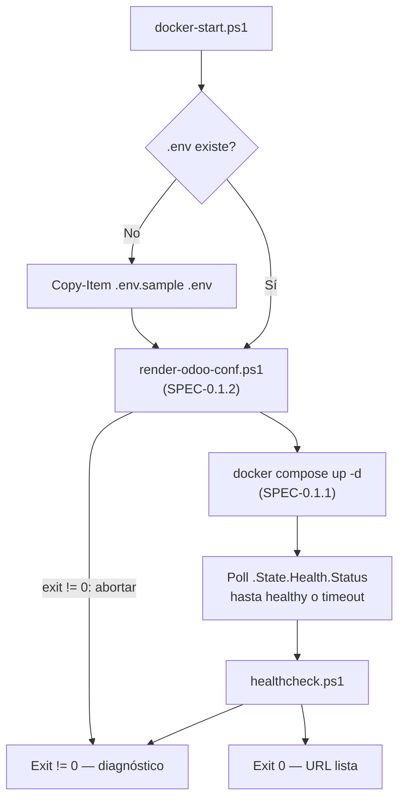

# Implementation Plan: Automatización de Ciclo de Vida de Contenedores y Healthcheck

**Branch**: `0.3.1-container-lifecycle-automation` | **Date**: 2026-09-29 | **Spec**: [`spec.md`](./spec.md)

**Input**: Feature specification from `specs/0-infrastructure/0.3-developer-tooling/0.3.1-container-lifecycle-automation/spec.md`

---

## Summary

Deliver five PowerShell wrappers that let a developer or an evaluator operate the entire ERP stack without knowing Docker: start, stop, restart, tail logs, and diagnose health. `docker-start.ps1` is the orchestrator — it provisions `.env` from the template, renders `config/odoo.conf` with the injected master password, brings the stack up, and blocks until the services are genuinely ready. `healthcheck.ps1` is the diagnostic primitive the other scripts and the local verification pipeline both call.

Two design corrections shape this plan. Readiness is determined by **polling the container health status**, not by the fixed `Start-Sleep -Seconds 5` in `spec.md` §4 — Odoo's cold start on Windows/WSL2 routinely exceeds five seconds, so the sketched script reports failure on a stack that is merely still booting, which is the worst possible outcome during a timed defense. And `healthcheck.ps1` must **exit non-zero when a component is down**, because `spec.md` §6 requires running it inside the local verification pipeline, and a script that always exits `0` cannot gate anything.

---

## Technical Context

**Language/Version**: Windows PowerShell 5.1+ (the version shipped with Windows 10/11), forward-compatible with PowerShell 7. No module dependencies beyond the built-in cmdlets.

**Primary Dependencies**: `docker compose` v2 and `docker inspect`; `Invoke-WebRequest -UseBasicParsing` for the HTTP probe; `scripts/render-odoo-conf.ps1` from `SPEC-0.1.2`.

**Storage**: None of its own. The scripts read `.env` and never write data; `docker-stop.ps1` is explicitly designed so no code path can destroy a volume without typed confirmation.

**Testing**: Behavioral verification — run each script against a healthy stack, a partially degraded stack, and a fully stopped stack, asserting both console output and exit codes. Recorded in `docs/test-procedures/test-procedure-0.3.1.md`.

**Target Platform**: Windows 10/11 with PowerShell and Docker Desktop (primary). Scripts run on PowerShell 7 on Linux too, since every Docker call is platform-neutral.

**Project Type**: Developer tooling — five operator-facing scripts in `scripts/`.

**Performance Goals**: `healthcheck.ps1` completes in under 3 seconds against a healthy stack. `docker-start.ps1` returns as soon as the stack is genuinely ready — typically under 20 seconds warm, under 90 seconds cold — rather than after a fixed delay. `docker-restart.ps1` issues the restart in under 5 seconds.

**Constraints**:
- Must run under the default Windows execution policy, with a documented bypass (`spec.md` §3, §8).
- Destructive commands require explicit confirmation (`spec.md` §3).
- No administrator elevation beyond whatever Docker itself requires (`spec.md` §7).
- All operator-facing output in Spanish (Constitution Principle V).
- No heavyweight GUI, no webhooks, no APM (`spec.md` §2.2).

**Scale/Scope**: 5 PowerShell scripts, 1 shared helper block, and the installation documentation touchpoint (`Instrucciones_Instalacion.txt`).

---

## Constitution Check

*GATE: Evaluated against Constitution v1.1.0 before Phase 0 research and re-verified after Phase 1 design.*

| Principle / Rule | Compliance Status | Justification / Implementation Reference |
| :--- | :--- | :--- |
| **I. Odoo Modular Architecture & MVC Separation** | **N/A** | No Odoo module code. `docker-restart.ps1` invokes `odoo -u panaderia` but does not modify the module. |
| **II. Atomic Sales-to-Inventory Synchronization** | **N/A** | No business logic. |
| **III. Proactive Stock Alerting & Data Integrity** | **PASS (protecting)** | `docker-stop.ps1` cannot reach `docker compose down -v` without typed confirmation, so the routine stop path can never destroy the data the bakery modules depend on. |
| **IV. Spec-Driven Verification & Traceable Test Procedures** | **PASS** | All three acceptance scenarios map to numbered steps in [`quickstart.md`](./quickstart.md); `healthcheck.ps1` returns a meaningful exit code so it is usable as an automated gate, which `spec.md` §6 requires. |
| **V. Operational Usability & Express Deployment Standards** | **PASS** | This feature *is* the implementation of Principle V's "turnkey installation" requirement: one command from a fresh clone to a running ERP, with color-coded diagnostics in Spanish. |
| **VI. Deterministic Local Docker Provisioning & Environment Parity** | **PASS** | `docker-start.ps1` makes `docker compose up -d` deterministic by auto-provisioning `.env`, rendering `odoo.conf`, and waiting on real readiness signals instead of a guess. |
| **Quality Gates — "containerized one-command launch"** | **PASS** | `./scripts/docker-start.ps1` is that one command. |

**Gate result**: PASS. Six deviations from the literal scripts in `spec.md` §4 are recorded in [Complexity Tracking](#complexity-tracking); two fix defects, four are usability or safety additions the spec's own requirements imply.

---

## Project Structure

### Documentation (this feature)

```text
specs/0-infrastructure/0.3-developer-tooling/0.3.1-container-lifecycle-automation/
├── spec.md                                  # Feature specification
├── plan.md                                  # Implementation plan (this file)
├── research.md                              # Phase 0 decisions & rejected alternatives
├── quickstart.md                            # Phase 1 operation & verification guide
├── contracts/                               # Phase 1 contracts
│   ├── lifecycle-scripts-cli-contract.md    # Parameters, exit codes, orchestration order
│   └── healthcheck-output-contract.md       # Probe matrix, output format, exit semantics
└── checklists/
    └── requirements.md                      # Specification quality checklist (pre-existing)
```

> `data-model.md` is intentionally absent: this feature defines no entities. Its structural contracts are the script CLI surface and the healthcheck output format.

### Source Code (repository root)

```text
des-panaderia-erp/
├── scripts/
│   ├── docker-start.ps1         # NEW — orchestrator: .env → render → up -d → wait → healthcheck
│   ├── docker-stop.ps1          # NEW — ordered shutdown; volumes safe by construction
│   ├── docker-restart.ps1       # NEW — restart web, with optional module upgrade
│   ├── docker-logs.ps1          # NEW — formatted log streaming, -Service / -Follow / -Tail
│   ├── healthcheck.ps1          # NEW — diagnostic primitive with a real exit code
│   ├── render-odoo-conf.ps1     # EXISTING (SPEC-0.1.2) — called by docker-start.ps1
│   ├── db-backup.ps1            # EXISTING (SPEC-0.2.1)
│   ├── db-restore.ps1           # EXISTING (SPEC-0.2.1)
│   └── db-init-seed.ps1         # EXISTING (SPEC-0.2.1)
└── Instrucciones_Instalacion.txt  # NEW/AMEND — execution policy guidance, one-command launch
```

**Structure Decision**: A single flat `scripts/` directory holds all nine scripts across the three Capa 0 features, so the operator has exactly one place to look — no nesting by concern, which would force someone under demo pressure to remember a taxonomy. The shared precondition helper is duplicated inline rather than extracted into a dot-sourced module: each script must remain independently runnable by copy-paste, and a missing `common.ps1` would break all five at once.

### Orchestration Flow



---

## Implementation Phases

### Phase 0 — Research (complete)

Resolved in [`research.md`](./research.md): why fixed-delay readiness is the single most likely cause of a false demo failure and what replaces it; why `healthcheck.ps1` needs a real exit code; `Invoke-WebRequest` behavior on PowerShell 5.1 including redirect following and its throw-on-error semantics; how to make volume destruction unreachable by accident; why a container restart alone does not apply a Python model change; and the execution-policy and `Unblock-File` realities on Windows.

### Phase 1 — Design & Contracts (complete)

1. [`contracts/lifecycle-scripts-cli-contract.md`](./contracts/lifecycle-scripts-cli-contract.md) — parameters, defaults, exit codes, and the normative orchestration order across the three Capa 0 features.
2. [`contracts/healthcheck-output-contract.md`](./contracts/healthcheck-output-contract.md) — the probe matrix, output format, color convention, and exit-code semantics.
3. [`quickstart.md`](./quickstart.md) — verification path covering all three acceptance scenarios.

### Phase 2 — Tasks (not produced by this command)

| Order | Task Group | Produces |
| :--- | :--- | :--- |
| 1 | Shared precondition helper | Docker-availability and `.env`-loading logic, inlined into each script |
| 2 | Healthcheck | `scripts/healthcheck.ps1` with the probe matrix and aggregate exit code |
| 3 | Start orchestrator | `scripts/docker-start.ps1` with `.env` bootstrap, render call, and health polling |
| 4 | Stop | `scripts/docker-stop.ps1` with volume destruction gated behind typed confirmation |
| 5 | Restart | `scripts/docker-restart.ps1` with `-Upgrade` and `-Wait` |
| 6 | Logs | `scripts/docker-logs.ps1` with `-Service`, `-Follow`, `-Tail` |
| 7 | Installation docs | `Instrucciones_Instalacion.txt` with the execution-policy bypass |
| 8 | Degraded-state verification | Each script exercised against healthy, degraded, and stopped stacks |
| 9 | Test procedure | `docs/test-procedures/test-procedure-0.3.1.md` |

---

## Traceability: Acceptance Criteria → Design

| Spec Scenario | Design Element | Verification |
| :--- | :--- | :--- |
| **1 — One-click automated startup from a clean environment** | `.env` auto-created from `.env.sample`; `render-odoo-conf.ps1` invoked; `up -d`; poll to ready; `healthcheck.ps1`; report the URL | `quickstart.md` §3 |
| **2 — Instant fault diagnosis** | Per-component probe matrix with red output naming the failed component, plus a non-zero exit code | `quickstart.md` §4 |
| **3 — Clean service shutdown** | `docker compose down` (no `-v`); no timeout errors; volumes verified intact afterward | `quickstart.md` §5 |
| **§6 — Log streaming** | `docker-logs.ps1 -Service web -Follow` | `quickstart.md` §6 |
| **§6 — Restart under 5 seconds** | `docker restart panaderia_odoo_web`; the command returns fast, with `-Wait` available when readiness matters | `quickstart.md` §7 |
| **§6 — Healthcheck in the local verification pipeline** | Aggregate exit code: `0` healthy, `1` degraded, `2` down | `quickstart.md` §8 |
| **§3 — Destructive commands require confirmation** | `-RemoveVolumes` demands the operator type `BORRAR` | `quickstart.md` §5 Step 4 |
| **§8 Risk — restricted execution policy** | `Instrucciones_Instalacion.txt` documents the bypass; `Unblock-File` covered for ZIP-downloaded copies | `quickstart.md` §2 |

---

## Complexity Tracking

> Constitution Check passed. Entries 1–2 fix defects; 3–6 are additions that the spec's own requirements imply but its §4 sketches omit.

| # | Deviation / Addition | Why Needed | Simpler Alternative Rejected Because |
| :--- | :--- | :--- | :--- |
| 1 | **Poll container health instead of `Start-Sleep -Seconds 5`** (the literal approach in `spec.md` §4). | Odoo's cold start loads the full base registry; on Windows/WSL2 this routinely takes 60–90 seconds. After a 5-second sleep the HTTP probe fails and `docker-start.ps1` reports a broken stack that is merely still booting. That is the single most likely cause of a false failure in front of the evaluator. Polling `.State.Health.Status` against the healthchecks defined in `SPEC-0.1.1` returns as soon as the stack is genuinely ready — usually *faster* than the fixed sleep on a warm start. | Raising the sleep to 90 seconds makes every warm start punishingly slow and still guesses wrong on a slow cold start. |
| 2 | **`healthcheck.ps1` exits non-zero when a component is unhealthy.** The `spec.md` §4 sketch always exits `0`. | `spec.md` §6 requires running it "dentro del pipeline de verificación local". A script that always succeeds cannot gate anything, and `docker-start.ps1` cannot branch on its result. Exit codes: `0` healthy, `1` degraded, `2` down. | Parsing the script's console text to infer status is brittle and breaks the moment a message is reworded or translated. |
| 3 | **Additive: `-Upgrade` switch on `docker-restart.ps1`**, running `odoo -u panaderia -d $ODOO_DB_NAME --stop-after-init` before the restart. | `spec.md` §2.1 states the script exists "para aplicar cambios en módulos de Python", but a container restart alone does **not** apply a model change — the module must be upgraded so Odoo re-reads the manifest, migrates the schema, and reloads the views. Compounding this, the `reload` flag in `dev_mode` is inert because `watchdog` is absent from the official image (`SPEC-0.1.2` `research.md` Decision 5). Without `-Upgrade` the script silently fails to do what its own spec says it does. | Documenting the manual `odoo -u` command works, but it leaves the script's stated purpose unmet and forces the operator to remember a longer command mid-iteration. |
| 4 | **Additive: `-RemoveVolumes` switch on `docker-stop.ps1`, gated behind typing `BORRAR`.** | `spec.md` §3 requires that destructive commands demand explicit confirmation. Simply omitting the capability does not satisfy the requirement — it just pushes the operator to type `docker compose down -v` by hand, with no guard at all. Providing the one safe path is stronger than providing none. | Omitting it entirely leaves the requirement unimplemented and the dangerous manual route unguarded. A `-Force`-style boolean is too easy to add reflexively from shell history; a typed word cannot be muscle memory. |
| 5 | **Additive: `docker-start.ps1` invokes `render-odoo-conf.ps1` and aborts on a non-zero exit.** | `SPEC-0.1.2` renders `config/odoo.conf` from a template with the master password injected from `.env`. Rendering must happen after `.env` exists and before Compose creates the container. If it is skipped, Odoo boots with a stale or absent config and the module appears missing — a symptom whose real cause is two steps upstream. | Requiring the operator to run the renderer manually breaks the one-command guarantee of Acceptance Scenario 1. |
| 6 | **Additive: `-Service`, `-Follow`, and `-Tail` parameters on `docker-logs.ps1`.** | `spec.md` §6 verification step 2 already invokes `docker-logs.ps1 -Follow`, so the parameter is required by the spec's own test plan even though §4 never defines it. `-Service` is needed because §2.1 says the script shows logs "del contenedor web o base de datos". | A parameterless script that dumps everything makes the operator scroll past PostgreSQL noise to find the Odoo traceback they are looking for. |

---

## Known Cross-Artifact Inconsistencies (for `/speckit-analyze`)

1. **`spec.md` §6 uses `docker-logs.ps1 -Follow`, a parameter §4 never defines.** Resolved by Complexity Tracking #6.
2. **`spec.md` §6 step 3 asserts "el reinicio tome menos de 5 segundos".** The `docker restart` *command* returns in about that time, but Odoo is not *serving* for considerably longer. The plan reads this as a command-duration requirement and offers `-Wait` for the cases where readiness is what actually matters; the spec wording should be tightened.
3. **`spec.md` §4 `healthcheck.ps1` tests `$response.StatusCode -eq 303`, which is unreachable.** `Invoke-WebRequest` follows redirects by default, so a `303` is resolved before `StatusCode` is read. Harmless, but the `303` branch is dead code; `/web/login` answers `200` directly.
4. **`spec.md` §9 omits `Instrucciones_Instalacion.txt`** from the deliverables even though §2.1 requires integration with it and §8 places the execution-policy mitigation there. Added as task group 7.
5. **`spec.md` §4 `docker-start.ps1` never renders `config/odoo.conf`**, so as written a fresh clone starts Odoo with no valid configuration. Resolved by Complexity Tracking #5.
