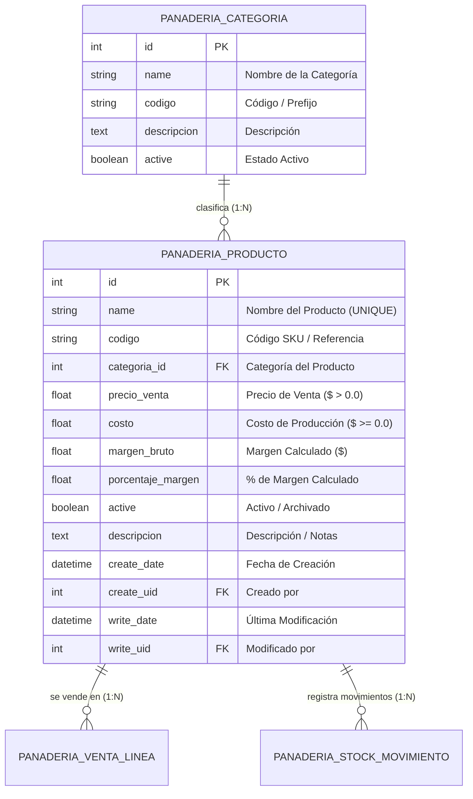
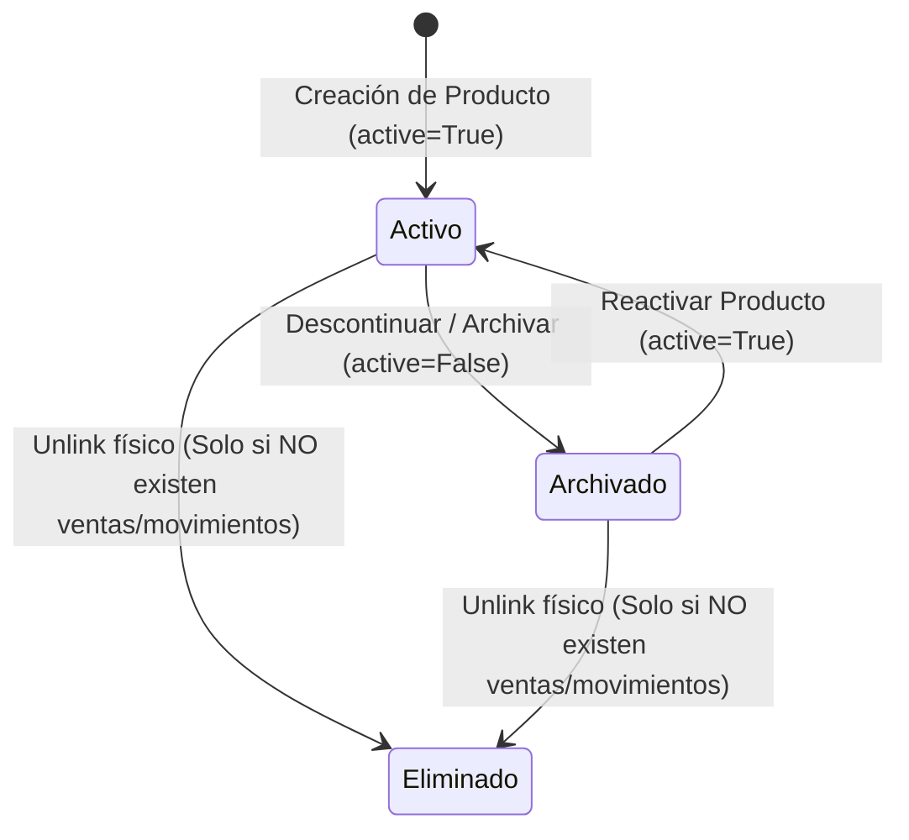

# Phase 1: Data Model - Gestión de Catálogo de Productos

**Feature**: `SPEC-1.1.1: Gestión de Catálogo de Productos`  
**Branch / Directory**: `specs/1-inventory/1.1-product-catalog/1.1.1-product-management`  
**Date**: 2026-09-29  
**Status**: Completed  

---

## 1. Conceptual & Relational Diagram



---

## 2. Entity Specifications

### 2.1. Primary Entity: `panaderia.producto`

* **Description**: Representa los productos elaborados y comercializados por la panadería "Delicias Dulces".
* **Table Name in PostgreSQL**: `panaderia_producto`
* **Python Model Class**: `PanaderiaProducto(models.Model)`

| Field Name | Type | Constraints & Options | Default | Description |
| :--- | :--- | :--- | :--- | :--- |
| `id` | `fields.Integer` | Primary Key, Auto-increment | Auto | Identificador único en BD. |
| `name` | `fields.Char` | `string='Nombre del Producto'`, `required=True`, `index=True` | `None` | Nombre comercial del producto (e.g. "Pan Francés Clásico"). |
| `codigo` | `fields.Char` | `string='Código / SKU'`, `copy=False`, `index=True` | `None` | Código alfanumérico o SKU del producto (e.g. "PAN-001"). |
| `categoria_id` | `fields.Many2one` | `comodel_name='panaderia.categoria'`, `string='Categoría'`, `required=True`, `ondelete='restrict'` | `None` | Relación con la categoría a la que pertenece el producto. |
| `precio_venta` | `fields.Float` | `string='Precio de Venta ($)'`, `required=True`, `digits=(10, 2)` | `0.0` | Precio unitario final cobrado al cliente. Debe ser $> 0$. |
| `costo` | `fields.Float` | `string='Costo de Producción ($)'`, `required=True`, `digits=(10, 2)` | `0.0` | Costo unitario de elaboración de la pieza/unidad. Debe ser $\ge 0$. |
| `margen_bruto` | `fields.Float` | `string='Margen Bruto ($)'`, `compute='_compute_margenes'`, `store=True`, `digits=(10, 2)` | `0.0` | Ganancia bruta unitaria: `precio_venta - costo`. |
| `porcentaje_margen` | `fields.Float` | `string='% Margen'`, `compute='_compute_margenes'`, `store=True`, `digits=(5, 2)` | `0.0` | Margen porcentual sobre el precio de venta. |
| `active` | `fields.Boolean` | `string='Activo'`, `default=True` | `True` | Permite archivar/descontinuar productos sin romper integridad histórica. |
| `descripcion` | `fields.Text` | `string='Descripción'` | `None` | Detalles sobre ingredientes, alérgenos o presentación. |
| `create_date` | `fields.Datetime` | Standard Odoo ORM Audit Field | `now()` | Fecha y hora de registro inicial. |
| `create_uid` | `fields.Many2one` | Standard Odoo ORM Audit Field (`res.users`) | Current User | Usuario creador del registro. |
| `write_date` | `fields.Datetime` | Standard Odoo ORM Audit Field | `now()` | Fecha y hora de última modificación. |
| `write_uid` | `fields.Many2one` | Standard Odoo ORM Audit Field (`res.users`) | Current User | Usuario que ejecutó la última actualización. |

---

## 3. Business Validation Rules & Invariants

### 3.1. SQL Constraints (`_sql_constraints`)

```python
_sql_constraints = [
    ('name_unique', 'UNIQUE(name)', 'Ya existe un producto registrado con este nombre. El nombre debe ser único.'),
    ('codigo_unique', 'UNIQUE(codigo)', 'Ya existe un producto registrado con este código / SKU.')
]
```

### 3.2. Python ORM Constraints (`@api.constrains`)

```python
@api.constrains('precio_venta', 'costo')
def _check_precios_y_costos(self):
    for record in self:
        if record.precio_venta <= 0.0:
            raise ValidationError("El precio de venta debe ser un valor estrictamente mayor a $0.00.")
        if record.costo < 0.0:
            raise ValidationError("El costo de producción no puede ser un valor negativo.")
```

### 3.3. Computed Logic (`@api.depends`)

```python
@api.depends('precio_venta', 'costo')
def _compute_margenes(self):
    for record in self:
        record.margen_bruto = record.precio_venta - record.costo
        if record.precio_venta > 0:
            record.porcentaje_margen = (record.margen_bruto / record.precio_venta) * 100.0
        else:
            record.porcentaje_margen = 0.0
```

---

## 4. Lifecycle and State Transitions



* **Estado Activo (`active=True`)**:
  * Visible en listados de punto de venta y catálogo general de panadería.
  * Disponible para selección en órdenes de venta (`SPEC-2.1.1`).
* **Estado Archivado (`active=False`)**:
  * Oculto de las vistas predeterminadas de selección de ventas y catálogo activo.
  * Preservado intacto para auditoría y visualización en ventas históricas e informes de facturación.
