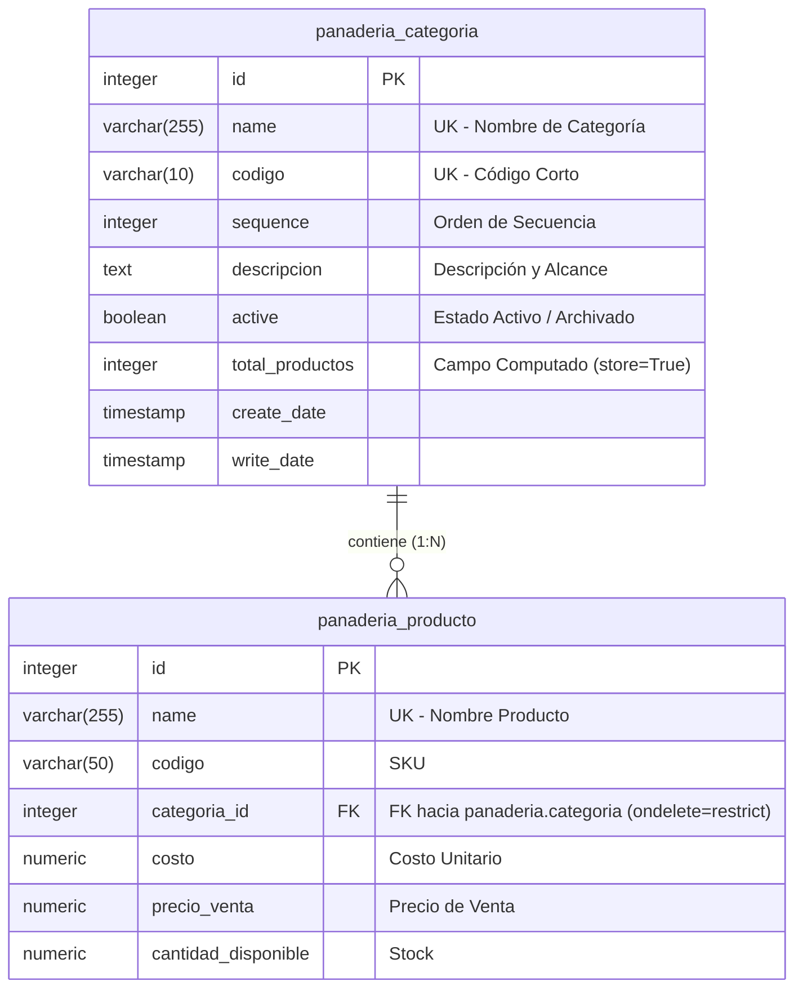

# Data Model: Categorías de Productos de Panadería

**Feature**: `SPEC-1.1.2: Categorías de Productos de Panadería`  
**Module**: `Modulo_Odoo`  
**Model Name**: `panaderia.categoria`  
**Database Table**: `panaderia_categoria`  

---

## 1. Entity-Relationship Overview

---

## 2. Field Specifications

| Technical Name | Odoo Field Type | PostgreSQL Type | Required | Default | Indexed | Description / Business Rules |
| :--- | :--- | :--- | :---: | :---: | :---: | :--- |
| `name` | `fields.Char` | `VARCHAR` | **Yes** | — | **Yes** | Nombre único de la categoría (e.g. Pan, Pastel, Galleta, Bebida). |
| `codigo` | `fields.Char(size=10)` | `VARCHAR(10)` | **Yes** | — | **Yes** | Prefijo o código corto de identificación (e.g. `PAN`, `PAS`, `GAL`, `BEB`). |
| `sequence` | `fields.Integer` | `INTEGER` | No | `10` | No | Secuencia numérica para ordenamiento manual en árbol y combos. |
| `descripcion` | `fields.Text` | `TEXT` | No | — | No | Descripción comercial y tipos de productos incluidos. |
| `active` | `fields.Boolean` | `BOOLEAN` | No | `True` | No | Bandera para archivado lógico sin pérdida de integridad referencial. |
| `producto_ids` | `fields.One2many` | *(Relational)* | No | — | No | Relación inversa con `panaderia.producto` vinculados vía `categoria_id`. |
| `total_productos` | `fields.Integer` | `INTEGER` | No | `0` | No | Conteo calculado en tiempo real con `store=True` dependiente de `producto_ids`. |

---

## 3. Invariants & Business Constraints

1. **Unicidad de Nombre y Código (SQL Constraint)**:
   - `categoria_name_unique`: `UNIQUE(name)`
   - `categoria_codigo_unique`: `UNIQUE(codigo)`
2. **Unicidad Case-Insensitive (ORM Constraint)**:
   - `@api.constrains('name', 'codigo')`: Compara contra registros existentes usando `=ilike` para evitar duplicados por variaciones de mayúsculas/minúsculas.
3. **Cálculo Reactivo de Total de Productos**:
   - `@api.depends('producto_ids')`: Actualiza automáticamente `total_productos = len(producto_ids)`.
4. **Protección Referencial de Integridad**:
   - `panaderia.producto.categoria_id` configurado con `ondelete='restrict'`, impidiendo la eliminación física de una categoría si tiene productos asociados.

---

## 4. Seed Data Matrix

| XML Record ID | `name` | `codigo` | `sequence` | `descripcion` | `active` |
| :--- | :--- | :--- | :---: | :--- | :---: |
| `categoria_pan` | `Pan` | `PAN` | 10 | Variedad de panes tradicionales, dulces, rústicos y artesanales. | `True` |
| `categoria_pastel` | `Pastel` | `PAS` | 20 | Pasteles para eventos, porciones individuales, postres fríos y tartas. | `True` |
| `categoria_galleta` | `Galleta` | `GAL` | 30 | Galletas horneadas, polvorones, pastas secas y repostería menor. | `True` |
| `categoria_bebida` | `Bebida` | `BEB` | 40 | Cafetería caliente, bebidas frías, jugos naturales y lácteos. | `True` |
