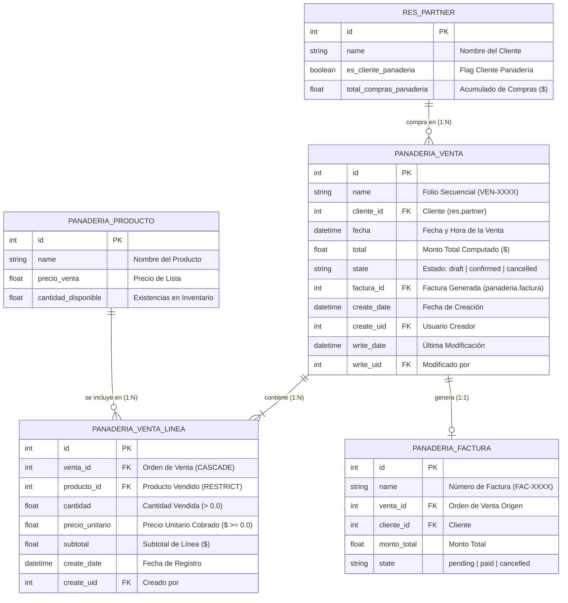
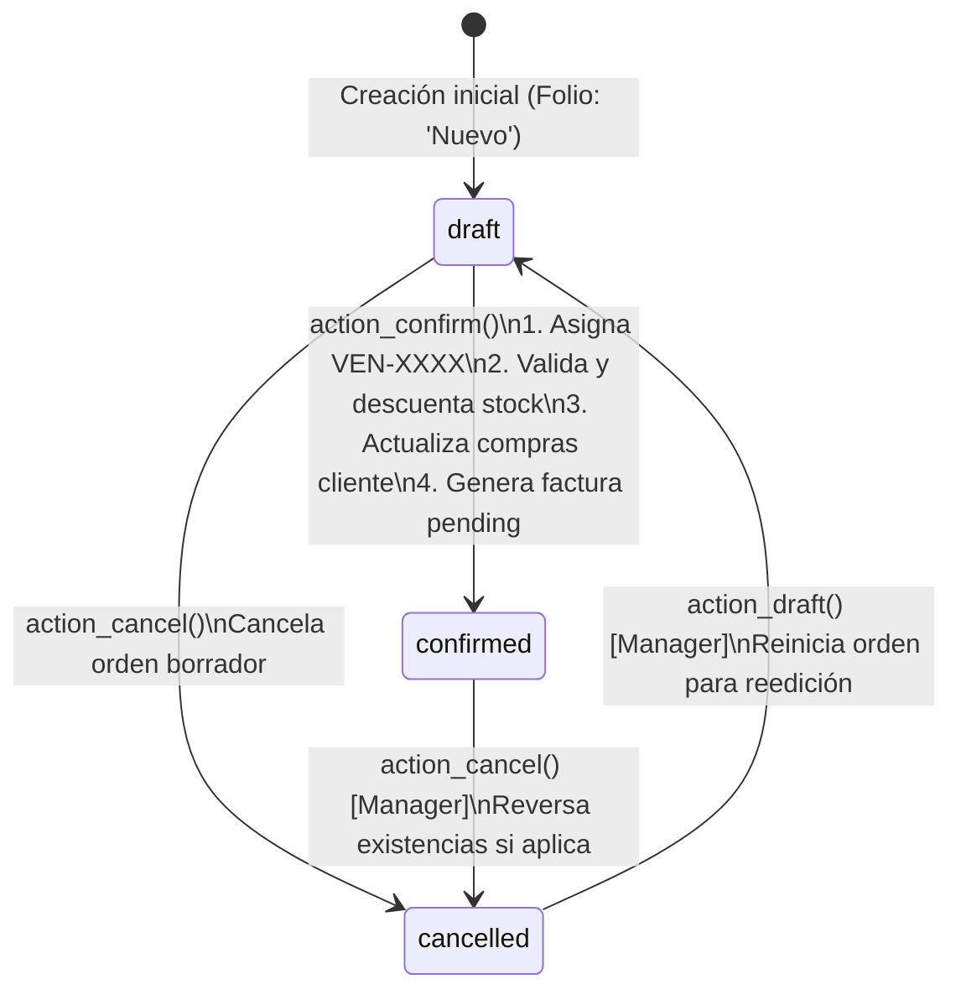

# Phase 1: Data Model - Registro y Proceso de Ventas Esencial

**Feature**: `SPEC-2.1.1: Registro y Proceso de Ventas Esencial`  
**Branch / Directory**: `specs/2-sales/2.1-sales-orders/2.1.1-order-management`  
**Date**: 2026-09-30  
**Status**: Completed  

---

## 1. Conceptual & Relational Diagram



---

## 2. Entity Specifications

### 2.1. Primary Entity: `panaderia.venta` (Sales Order Header)

* **Description**: Representa el encabezado de una transacción de venta realizada en mostrador o caja de la panadería.
* **Table Name in PostgreSQL**: `panaderia_venta`
* **Python Model Class**: `PanaderiaVenta(models.Model)`
* **Ordering**: `fecha desc, name desc, id desc`

| Field Name | Type | Constraints & Options | Default | Description |
| :--- | :--- | :--- | :--- | :--- |
| `id` | `fields.Integer` | Primary Key, Auto-increment | Auto | Identificador único en la base de datos. |
| `name` | `fields.Char` | `string='Folio'`, `required=True`, `copy=False`, `readonly=True`, `index=True` | `'Nuevo'` | Folio secuencial formal (`VEN-XXXX`) asignado al confirmar. |
| `cliente_id` | `fields.Many2one` | `comodel_name='res.partner'`, `string='Cliente'`, `required=True`, `index=True` | `None` | Cliente asociado a la compra. Permite seleccionar clientes registrados o cliente de mostrador. |
| `fecha` | `fields.Datetime` | `string='Fecha de Venta'`, `required=True`, `index=True` | `fields.Datetime.now` | Fecha y hora en que se registra la operación. |
| `linea_ids` | `fields.One2many` | `comodel_name='panaderia.venta.linea'`, `inverse_name='venta_id'`, `string='Líneas de Venta'` | `None` | Conjunto de renglones o productos incluidos en el pedido. |
| `total` | `fields.Float` | `string='Total ($)'`, `compute='_compute_total'`, `store=True`, `digits=(10, 2)` | `0.0` | Importe total bruto calculado reactivamente como la suma de los subtotales de las líneas. |
| `state` | `fields.Selection` | `selection=[('draft', 'Borrador'), ('confirmed', 'Confirmada'), ('cancelled', 'Cancelada')]`, `string='Estado'`, `default='draft'`, `required=True`, `tracking=True`, `index=True` | `'draft'` | Estado operativo dentro del ciclo de vida de la orden. |
| `factura_id` | `fields.Many2one` | `comodel_name='panaderia.factura'`, `string='Factura Asociada'`, `readonly=True`, `copy=False` | `None` | Comprobante fiscal/factura simple generado automáticamente al confirmar la venta. |
| `lineas_count` | `fields.Integer` | `string='Total de Ítems'`, `compute='_compute_lineas_count'` | `0` | Contador de renglones para resúmenes en listados y badges. |
| `create_date` | `fields.Datetime` | Standard Odoo ORM Audit Field | `now()` | Fecha y hora de creación inicial en el sistema. |
| `create_uid` | `fields.Many2one` | Standard Odoo ORM Audit Field (`res.users`) | Current User | Usuario/Cajero que abrió la orden de venta. |
| `write_date` | `fields.Datetime` | Standard Odoo ORM Audit Field | `now()` | Fecha y hora del último cambio o confirmación. |
| `write_uid` | `fields.Many2one` | Standard Odoo ORM Audit Field (`res.users`) | Current User | Usuario que ejecutó la última modificación. |

---

### 2.2. Child Entity: `panaderia.venta.linea` (Sales Order Detail Line)

* **Description**: Representa cada producto individual, cantidad y precio unitario dentro de una orden de venta.
* **Table Name in PostgreSQL**: `panaderia_venta_linea`
* **Python Model Class**: `PanaderiaVentaLinea(models.Model)`
* **Ordering**: `id asc`

| Field Name | Type | Constraints & Options | Default | Description |
| :--- | :--- | :--- | :--- | :--- |
| `id` | `fields.Integer` | Primary Key, Auto-increment | Auto | Identificador único de la línea en BD. |
| `venta_id` | `fields.Many2one` | `comodel_name='panaderia.venta'`, `string='Orden de Venta'`, `required=True`, `ondelete='cascade'`, `index=True` | `None` | Orden de venta a la que pertenece esta línea. Cascada al eliminar borrador. |
| `producto_id` | `fields.Many2one` | `comodel_name='panaderia.producto'`, `string='Producto'`, `required=True`, `ondelete='restrict'`, `index=True` | `None` | Producto de panadería comercializado. Restringe borrado físico si hay ventas. |
| `cantidad` | `fields.Float` | `string='Cantidad'`, `required=True`, `digits=(10, 2)` | `1.0` | Número de unidades o piezas vendidas. Debe ser $> 0.0$. |
| `precio_unitario` | `fields.Float` | `string='Precio Unitario ($)'`, `required=True`, `digits=(10, 2)` | `0.0` | Precio unitario aplicado a la línea (autocompletado desde `producto_id.precio_venta`). Debe ser $\ge 0.0$. |
| `subtotal` | `fields.Float` | `string='Subtotal ($)'`, `compute='_compute_subtotal'`, `store=True`, `digits=(10, 2)` | `0.0` | Importe monetario de la línea: `cantidad * precio_unitario`. |

---

## 3. Business Validation Rules & Invariants

### 3.1. Field Constraints (`@api.constrains`)

```python
# En panaderia.venta.linea
@api.constrains('cantidad', 'precio_unitario')
def _check_cantidades_y_precios(self):
    for line in self:
        if line.cantidad <= 0.0:
            raise ValidationError("La cantidad vendida debe ser estrictamente mayor a 0.00.")
        if line.precio_unitario < 0.0:
            raise ValidationError("El precio unitario no puede ser un valor negativo.")

# En panaderia.venta
@api.constrains('linea_ids')
def _check_lineas_no_vacias(self):
    for venta in self:
        if venta.state == 'confirmed' and not venta.linea_ids:
            raise ValidationError("No es posible confirmar una orden de venta sin al menos una línea de producto.")
```

### 3.2. Computed Logic (`@api.depends`) & Autocompletion (`@api.onchange`)

```python
# En panaderia.venta.linea
@api.onchange('producto_id')
def _onchange_producto_id(self):
    if self.producto_id:
        self.precio_unitario = self.producto_id.precio_venta

@api.depends('cantidad', 'precio_unitario')
def _compute_subtotal(self):
    for line in self:
        line.subtotal = round(line.cantidad * line.precio_unitario, 2)

# En panaderia.venta
@api.depends('linea_ids.subtotal')
def _compute_total(self):
    for order in self:
        order.total = round(sum(order.linea_ids.mapped('subtotal')), 2)
```

---

## 4. Lifecycle State Machine & Workflow Transitions



### 4.1. Transition Rules:
1. **Confirmación (`action_confirm`)**:
   - Precondición: `state == 'draft'` y `len(linea_ids) > 0`.
   - Si `name == 'Nuevo'`, invoca `self.env['ir.sequence'].next_by_code('panaderia.venta.secuencia')`.
   - Para cada línea en `linea_ids`:
     - Verifica si `line.producto_id.cantidad_disponible < line.cantidad`. Si es menor, emite `ValidationError` indicando stock insuficiente del producto.
     - Decrementa `line.producto_id.cantidad_disponible -= line.cantidad`.
   - Si existe `panaderia.factura` en el entorno, crea el registro de factura con `venta_id=order.id`, `cliente_id=order.cliente_id.id`, `monto_total=order.total`, `state='pending'` y asigna `order.factura_id`.
   - Actualiza `order.cliente_id.total_compras_panaderia` sumando el importe si el campo existe.
   - Pasa `order.state = 'confirmed'`.
2. **Immutabilidad Post-Confirmación**:
   - Si un usuario intenta invocar `write()` alterando `linea_ids`, `cliente_id` o `total` en una orden con `state == 'confirmed'`, el sistema rechaza la operación con `UserError("No se pueden modificar órdenes de venta en estado confirmada.")`.
   - Si un usuario intenta invocar `unlink()` sobre una orden confirmada, el método rechaza la eliminación con `UserError("No se pueden eliminar órdenes de venta confirmadas.")`.

---

## 5. Security & Access Control Mapping

| Model Name | Group Identifier | Read | Write | Create | Unlink | Notes |
| :--- | :--- | :---: | :---: | :---: | :---: | :--- |
| `panaderia.venta` | `group_panaderia_user` (Operador) | 1 | 1 | 1 | 0 | Puede registrar y confirmar ventas; no puede borrar órdenes. |
| `panaderia.venta` | `group_panaderia_manager` (Admin) | 1 | 1 | 1 | 1 | Acceso administrativo completo; unlink limitado por ORM. |
| `panaderia.venta.linea` | `group_panaderia_user` (Operador) | 1 | 1 | 1 | 1 | Permite editar y suprimir líneas dentro del borrador. |
| `panaderia.venta.linea` | `group_panaderia_manager` (Admin) | 1 | 1 | 1 | 1 | Control total de líneas en borradores. |
