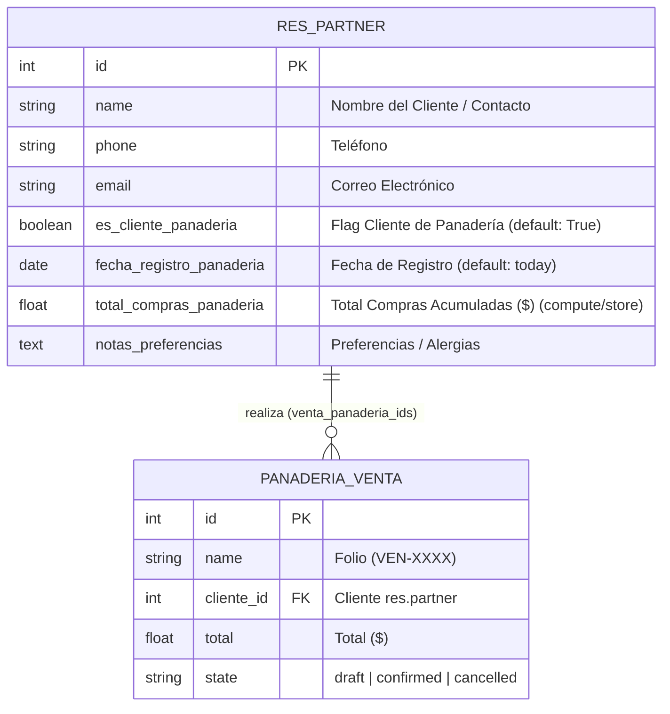

# Data Model: SPEC-3.1.1 Extensión y Registro de Clientes

**Branch**: `3.1.1-bakery-customer-management` | **Date**: 2026-09-30 | **Spec**: [`specs/3-customers/3.1-partner-extension/3.1.1-bakery-customer-management/spec.md`](file:///d:/UDB/CICLO-10-2026/DES/LAB/Desafio%203/des-panaderia-erp/specs/3-customers/3.1-partner-extension/3.1.1-bakery-customer-management/spec.md)

---

## 1. Entity Extension: `res.partner`

The base `res.partner` model is extended with specific fields for bakery operations without modifying core Odoo logic.



---

## 2. Field Specifications

| Technical Name | Type | Options / Attributes | Default / Compute | Description |
| :--- | :--- | :--- | :--- | :--- |
| `es_cliente_panaderia` | `Boolean` | `index=True` | `True` | Identifies if this partner is a customer of the bakery business. |
| `fecha_registro_panaderia` | `Date` | `index=True` | `fields.Date.context_today` | Date when the customer was registered in the bakery system. |
| `total_compras_panaderia` | `Float` | `store=True`, `digits=(10, 2)` | `_compute_total_compras_panaderia` | Sum of all confirmed sales orders (`state == 'confirmed'`). |
| `notas_preferencias` | `Text` | - | `False` | Notes regarding dietary restrictions, favorite breads, or allergies. |
| `venta_panaderia_ids` | `One2many` | `comodel_name='panaderia.venta'`, `inverse_name='cliente_id'` | - | Relation to all bakery sales registered for this customer. |

---

## 3. Computational Logic & Invariants

### Purchase Accumulation (`_compute_total_compras_panaderia`)
```python
@api.depends('venta_panaderia_ids.state', 'venta_panaderia_ids.total')
def _compute_total_compras_panaderia(self):
    for partner in self:
        ventas_confirmadas = partner.venta_panaderia_ids.filtered(lambda v: v.state == 'confirmed')
        partner.total_compras_panaderia = round(sum(ventas_confirmadas.mapped('total')), 2)
```

**Invariants**:
1. Only sales orders with `state == 'confirmed'` contribute to `total_compras_panaderia`.
2. Cancelled (`cancelled`) or draft (`draft`) sales do NOT contribute to the accumulated total.
3. If an order transitions from `confirmed` $\to$ `cancelled`, the total is automatically recalculated and reduced by the exact order amount.
4. If an order has 0 confirmed sales, `total_compras_panaderia` equals `0.00`.
