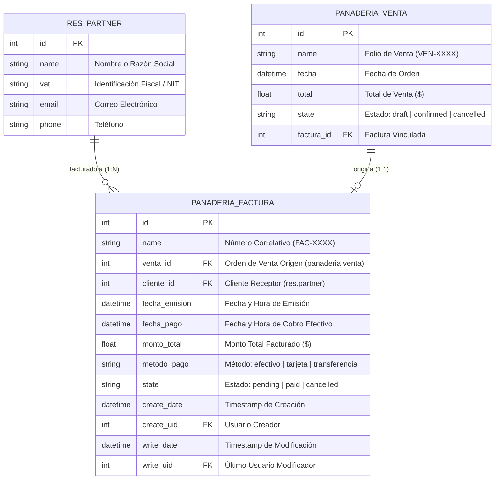
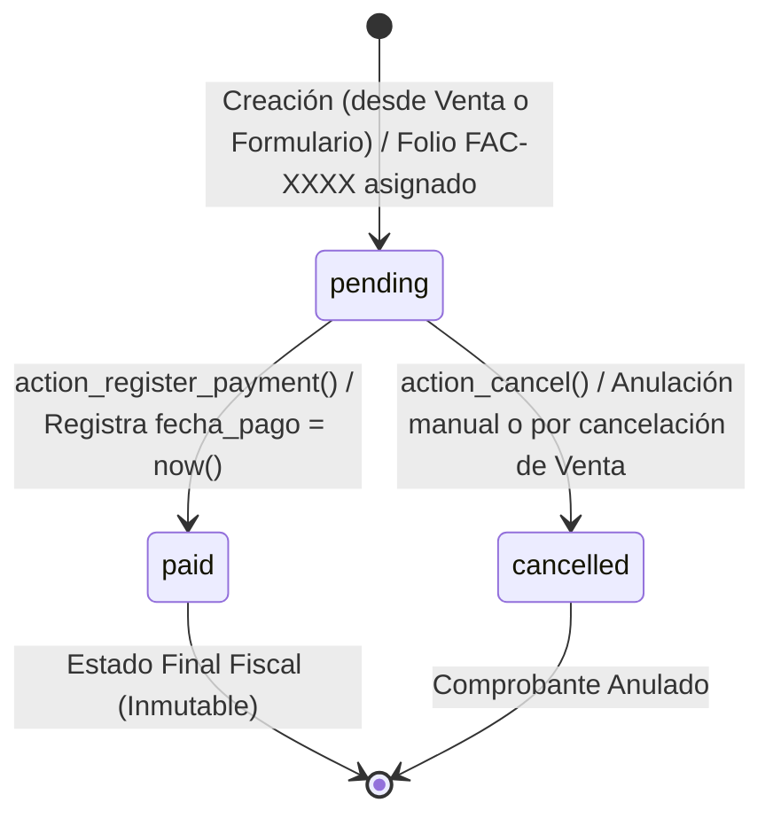

# Phase 1: Data Model - Generación de Facturas Simples

**Feature**: `SPEC-4.1.1: Generación de Facturas Simples`  
**Branch / Directory**: `specs/4-invoicing/4.1-customer-invoices/4.1.1-simple-invoice-generation`  
**Date**: 2026-09-30  
**Status**: Completed  

---

## 1. Conceptual & Relational Diagram



---

## 2. Entity Specifications: `panaderia.factura`

* **Model Name (`_name`)**: `panaderia.factura`
* **Model Description (`_description`)**: Factura Simple de Panadería
* **Database Table**: `panaderia_factura`
* **Default Ordering (`_order`)**: `fecha_emision desc, name desc, id desc`

### 2.1. Field Definitions & Data Dictionary

| Campo ORM | Tipo Odoo | Tipo SQL | Requerido | Readonly | Valores / Predeterminado | Descripción & Reglas de Negocio |
| :--- | :--- | :--- | :--- | :--- | :--- | :--- |
| `name` | `fields.Char` | `VARCHAR` | Sí | Sí | `'Borrador'` (inicial) $\to$ `FAC-XXXX` | Número correlativo único asignado automáticamente por `ir.sequence`. Indexado. |
| `venta_id` | `fields.Many2one` | `INTEGER FK` | No | Sí | `comodel_name='panaderia.venta'` | Vínculo a la orden de venta origen. `ondelete='set null'`. Indexado. |
| `cliente_id` | `fields.Many2one` | `INTEGER FK` | Sí | No* | `comodel_name='res.partner'` | Cliente receptor de la factura. Readonly si `state in ('paid', 'cancelled')`. Indexado. |
| `fecha_emision` | `fields.Datetime` | `TIMESTAMP` | Sí | No* | `fields.Datetime.now` | Fecha y hora en que se emitió el comprobante. Readonly si `state in ('paid', 'cancelled')`. |
| `fecha_pago` | `fields.Datetime` | `TIMESTAMP` | No | Sí | `None` | Registra el momento exacto en que la factura pasa a estado `paid`. |
| `monto_total` | `fields.Float` | `NUMERIC(10,2)` | Sí | No* | `0.0` (o total de la orden) | Importe total a cobrar en dólares. Debe ser $\ge 0.0$. Readonly si `state in ('paid', 'cancelled')`. |
| `metodo_pago` | `fields.Selection` | `VARCHAR` | Sí | No* | `'efectivo'` | `[('efectivo', 'Efectivo'), ('tarjeta', 'Tarjeta de Débito / Crédito'), ('transferencia', 'Transferencia')]`. |
| `state` | `fields.Selection` | `VARCHAR` | Sí | Sí | `'pending'` | Ciclo de cobro: `[('pending', 'Pendiente'), ('paid', 'Pagada'), ('cancelled', 'Cancelada')]`. Tracking activado. Indexado. |

*\* Nota: Los campos marcados con `No*` son editables únicamente mientras la factura permanezca en estado `'pending'`. Una vez pagada o cancelada, se bloquean tanto a nivel visual como en el ORM.*

---

## 3. Sequence Configuration (`ir.sequence`)

Definida en `Modulo_Odoo/data/factura_sequence.xml`:

```xml
<?xml version="1.0" encoding="utf-8"?>
<odoo>
    <data noupdate="1">
        <record id="seq_panaderia_factura" model="ir.sequence">
            <field name="name">Secuencia de Facturas de Panadería</field>
            <field name="code">panaderia.factura.secuencia</field>
            <field name="prefix">FAC-</field>
            <field name="padding">4</field>
            <field name="number_next">1</field>
            <field name="number_increment">1</field>
            <field name="company_id" eval="False"/>
        </record>
    </data>
</odoo>
```

---

## 4. State Transitions & Business Logic State Machine



### 4.1. Transition Rules & Preconditions

1. **`pending` $\to$ `paid`**:
   - **Trigger**: Botón "Registrar Pago" (`action_register_payment`).
   - **Precondition**: `state == 'pending'`.
   - **Postcondition**: `state = 'paid'`, `fecha_pago = fields.Datetime.now()`.
2. **`pending` $\to$ `cancelled`**:
   - **Trigger**: Botón "Cancelar Factura" (`action_cancel`) o llamada en cascada desde `panaderia.venta.action_cancel()`.
   - **Precondition**: `state == 'pending'`.
   - **Postcondition**: `state = 'cancelled'`.
3. **Immutability of `paid`**:
   - Una factura pagada no puede volver a `pending` ni a `cancelled` salvo intervención de administrador mediante auditoría especial.
   - Cualquier intento de invocar `unlink()` sobre una factura pagada lanzará `UserError`.

---

## 5. Domain Constraints & Validations

1. **Total Amount Positive Validation**:
   ```python
   @api.constrains('monto_total')
   def _check_monto_total(self):
       for rec in self:
           if rec.monto_total < 0.0:
               raise ValidationError("El monto total de la factura no puede ser negativo.")
   ```

2. **Single Active Invoice per Sale Order**:
   ```python
   @api.constrains('venta_id')
   def _check_unique_active_invoice_per_sale(self):
       for rec in self:
           if rec.venta_id and rec.state != 'cancelled':
               duplicates = self.search([
                   ('venta_id', '=', rec.venta_id.id),
                   ('id', '!=', rec.id),
                   ('state', '!=', 'cancelled')
               ])
               if duplicates:
                   raise ValidationError(
                       f"La orden de venta '{rec.venta_id.name}' ya tiene una factura activa asociada ({duplicates[0].name})."
                   )
   ```

3. **Anti-Tampering Immutability on Write**:
   ```python
   def write(self, vals):
       protected_fields = {'monto_total', 'cliente_id', 'venta_id', 'fecha_emision'}
       for rec in self:
           if rec.state == 'paid' and any(f in vals for f in protected_fields):
               raise UserError("No se pueden modificar datos financieros de una factura que ya ha sido pagada.")
       return super(PanaderiaFactura, self).write(vals)
   ```

4. **Audit Protection on Deletion**:
   ```python
   def unlink(self):
       for rec in self:
           if rec.state == 'paid':
               raise UserError("No se pueden eliminar facturas en estado Pagada por motivos de auditoría contable.")
       return super(PanaderiaFactura, self).unlink()
   ```

---

## 6. Access Control & Security Matrix

Defined in `Modulo_Odoo/security/ir.model.access.csv`:

| ID de Regla | Modelo | Grupo | Read | Write | Create | Unlink |
| :--- | :--- | :--- | :---: | :---: | :---: | :---: |
| `access_panaderia_factura_user` | `panaderia.factura` | `group_panaderia_user` (Cajeros) | 1 | 1 | 1 | 0 |
| `access_panaderia_factura_manager` | `panaderia.factura` | `group_panaderia_manager` (Administradores) | 1 | 1 | 1 | 1 |
