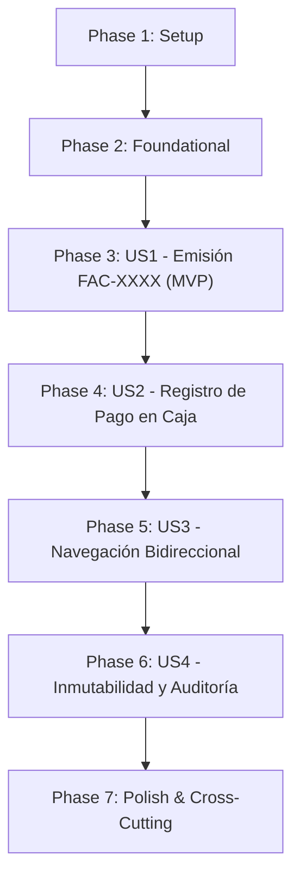

# Tasks: Generación de Facturas Simples

**Feature**: `SPEC-4.1.1: Generación de Facturas Simples`  
**Branch**: `4.1.1-simple-invoice-generation`  
**Spec**: [`specs/4-invoicing/4.1-customer-invoices/4.1.1-simple-invoice-generation/spec.md`](spec.md)  
**Plan**: [`specs/4-invoicing/4.1-customer-invoices/4.1.1-simple-invoice-generation/plan.md`](plan.md)  
**Data Model**: [`specs/4-invoicing/4.1-customer-invoices/4.1.1-simple-invoice-generation/data-model.md`](data-model.md)  
**ORM Contract**: [`specs/4-invoicing/4.1-customer-invoices/4.1.1-simple-invoice-generation/contracts/factura-orm-contract.md`](contracts/factura-orm-contract.md)  
**Views Contract**: [`specs/4-invoicing/4.1-customer-invoices/4.1.1-simple-invoice-generation/contracts/factura-views-contract.md`](contracts/factura-views-contract.md)  

---

## Phase 1: Setup (Module Manifest & Sequence Registration)

**Purpose**: Module registrations, loader imports, and baseline structural scaffolding for the simple invoicing feature.

- [X] T001 Register `data/factura_sequence.xml` and `views/factura_views.xml` in data list of `Modulo_Odoo/__manifest__.py`
- [X] T002 [P] Register test suite import `from . import test_factura` in `Modulo_Odoo/tests/__init__.py`

---

## Phase 2: Foundational (Sequence Configuration & Access Control)

**Purpose**: Core sequential numbering record and access control definitions that MUST be complete before invoice generation can operate.

**⚠️ CRITICAL**: Invoice auto-numbering and role-based security depend on this foundation.

- [X] T003 Define sequence record `seq_panaderia_factura` in `Modulo_Odoo/data/factura_sequence.xml` with `name="Secuencia de Facturas de Panadería"`, `code="panaderia.factura.secuencia"`, `prefix="FAC-"`, and `padding="4"`
- [X] T004 [P] Verify and ensure Access Control List entries `access_panaderia_factura_user` and `access_panaderia_factura_manager` are declared in `Modulo_Odoo/security/ir.model.access.csv`

**Checkpoint**: Foundation ready — Sequential numbering and model permissions established. User Story implementation can proceed.

---

## Phase 3: User Story 1 - Emisión y Numeración Automática Correlativa FAC-XXXX (Priority: P1) 🌟 MVP

**Goal**: Permitir la emisión automática y manual de comprobantes de facturación simple en Odoo asignando numeración correlativa automática (`FAC-XXXX`), asociando el cliente receptor, monto total y orden de venta origen en estado pendiente (`pending`).

**Independent Test**: Confirmar una orden de venta de mostrador de $16.00 o crear una factura manual para "Cliente Mostrador"; verificar que se genera un comprobante con folio correlativo (ej. `FAC-0001`), cliente asignado, fecha de emisión actual, monto exacto de $16.00 y estado inicial `pending`.

### Tests for User Story 1 ⚠️

> **NOTE: Write these tests FIRST, ensure they FAIL before implementation**

- [X] T005 [P] [US1] Create automated unit tests for invoice sequence numbering (`FAC-XXXX`), default values, and initial `pending` state in `Modulo_Odoo/tests/test_factura.py`

### Implementation for User Story 1

- [X] T006 [US1] Override `create()` method in `Modulo_Odoo/models/factura.py` to assign sequential numbering using `self.env['ir.sequence'].next_by_code('panaderia.factura.secuencia') or 'FAC-0001'` when `vals.get('name', 'Borrador') == 'Borrador'` or not `vals.get('name')`
- [X] T007 [US1] Declare Tree view `view_panaderia_factura_tree` in `Modulo_Odoo/views/factura_views.xml` with columns `name`, `fecha_emision`, `cliente_id`, `venta_id`, `metodo_pago`, `monto_total` (`sum="Total Facturado"`), and `state` (`widget="badge"`)
- [X] T008 [US1] Declare Form view `view_panaderia_factura_form` in `Modulo_Odoo/views/factura_views.xml` with title `name`, groups for "Datos del Comprobante" (`cliente_id`, `fecha_emision`, `fecha_pago`, `venta_id`) and "Detalles de Cobro" (`monto_total`, `metodo_pago`), and statusbar for `state` (`statusbar_visible="pending,paid"`)
- [X] T009 [US1] Declare Search view `view_panaderia_factura_search` in `Modulo_Odoo/views/factura_views.xml` with search inputs by `name`, `cliente_id`, `venta_id`, filters for "Pendientes de Pago", "Pagadas", "Canceladas", "Emitidas Hoy", and group-by options
- [X] T010 [US1] Declare window action `action_panaderia_factura` and menu items (`Panadería` -> `Facturación` -> `Facturas de Clientes`) in `Modulo_Odoo/views/factura_views.xml`

**Checkpoint**: User Story 1 (MVP) is fully functional and testable independently. Cashiers can view and create invoices with automatic `FAC-XXXX` numbering.

---

## Phase 4: User Story 2 - Registro de Pago en Caja y Ciclo de Cobranza (Priority: P2)

**Goal**: Permitir al cajero registrar el pago de la factura en mostrador mediante un solo clic en "Registrar Pago", transicionando el estado a pagada (`paid`), registrando la fecha/hora exacta del cobro (`fecha_pago`) y confirmando el método de pago utilizado (`metodo_pago`).

**Independent Test**: Abrir una factura en estado `pending` por $16.00; seleccionar método de pago "Efectivo" o "Tarjeta de Débito / Crédito"; presionar "Registrar Pago"; verificar que el estado cambia a `paid`, `fecha_pago` se llena con la fecha/hora actual y el botón de cobro se oculta del encabezado.

### Tests for User Story 2 ⚠️

- [X] T011 [P] [US2] Create automated unit test for `action_register_payment()` and `action_cancel()` verifying state transitions, payment timestamp assignment, and cancelled invoice handling in `Modulo_Odoo/tests/test_factura.py`

### Implementation for User Story 2

- [X] T012 [US2] Implement `action_register_payment(self)` in `Modulo_Odoo/models/factura.py` updating `state = 'paid'` and `fecha_pago = fields.Datetime.now()`
- [X] T013 [US2] Implement `action_cancel(self)` in `Modulo_Odoo/models/factura.py` allowing cancellation of pending invoices with `state = 'cancelled'`
- [X] T014 [US2] Add action buttons in header of `view_panaderia_factura_form` in `Modulo_Odoo/views/factura_views.xml`: "Registrar Pago" (`name="action_register_payment"`, `class="oe_highlight"`, `attrs="{'invisible': [('state', '!=', 'pending')]}"`) and "Cancelar Factura" (`name="action_cancel"`, `attrs="{'invisible': [('state', '!=', 'pending')]}"`)

**Checkpoint**: User Stories 1 and 2 operate together, enabling the complete invoice issuance and collection lifecycle.

---

## Phase 5: User Story 3 - Navegación Bidireccional entre Venta y Factura (Priority: P3)

**Goal**: Proveer navegación instantánea y contextual entre la orden de venta y su factura mediante botones Smart Button en ambas direcciones, agilizando la operación del cajero sin perder de vista los pedidos.

**Independent Test**: Confirmar una orden de venta `VEN-0001`; hacer clic en el Smart Button "Factura" para navegar a `FAC-0001`; en el formulario de la factura, hacer clic en el Smart Button "Ver Orden de Venta"; verificar que el sistema regresa de inmediato a la orden de venta original sin pérdida de contexto.

### Tests for User Story 3 ⚠️

- [X] T015 [P] [US3] Create automated unit test verifying bidirectional navigation actions `action_view_factura()` on `panaderia.venta` and `action_view_venta()` on `panaderia.factura` in `Modulo_Odoo/tests/test_factura.py`

### Implementation for User Story 3

- [X] T016 [US3] Implement `action_view_venta(self)` in `Modulo_Odoo/models/factura.py` returning an `ir.actions.act_window` dictionary targeting `panaderia.venta` form view with `res_id = self.venta_id.id`
- [X] T017 [US3] Add Smart Button "Ver Orden de Venta" (`icon="fa-shopping-cart"`, calling `action_view_venta`) in `oe_button_box` of `view_panaderia_factura_form` in `Modulo_Odoo/views/factura_views.xml` (visible when `venta_id` is present)
- [X] T018 [US3] Verify and ensure Smart Button "Factura" in `view_panaderia_venta_form` in `Modulo_Odoo/views/venta_views.xml` correctly invokes `action_view_factura` to display the linked invoice

**Checkpoint**: User Stories 1, 2, and 3 work seamlessly, providing unified cross-document cashier workflows.

---

## Phase 6: User Story 4 - Inmutabilidad Financiera, Restricciones y Auditoría Contable (Priority: P4)

**Goal**: Garantizar la integridad fiscal y contable bloqueando cualquier alteración o eliminación de facturas una vez pagadas, impidiendo montos negativos y evitando facturas duplicadas para una misma venta.

**Independent Test**: Tomar una factura en estado `paid`; intentar modificar `monto_total`, `cliente_id` o `venta_id` vía ORM; comprobar que se arroja un `UserError` ("No se pueden modificar datos financieros de una factura que ya ha sido pagada."); intentar eliminar la factura mediante `unlink()` y comprobar que se arroja un `UserError` ("No se pueden eliminar facturas en estado Pagada por motivos de auditoría contable."); intentar registrar un monto negativo y validar que se rechaza mediante `ValidationError`.

### Tests for User Story 4 ⚠️

- [X] T019 [P] [US4] Create automated unit tests for post-payment immutability on `write()`, deletion prevention on `unlink()`, positive amount validation, and duplicate invoice check in `Modulo_Odoo/tests/test_factura.py`

### Implementation for User Story 4

- [X] T020 [US4] Implement `@api.constrains('monto_total')` in `Modulo_Odoo/models/factura.py` verifying `monto_total >= 0.0` ("El monto total de la factura no puede ser negativo.")
- [X] T021 [US4] Implement `@api.constrains('venta_id')` in `Modulo_Odoo/models/factura.py` verifying that no more than one active (non-cancelled) invoice exists for the same sales order
- [X] T022 [US4] Override `write(self, vals)` in `Modulo_Odoo/models/factura.py` to raise `UserError("No se pueden modificar los datos financieros de una factura que ya ha sido pagada.")` if `state == 'paid'` and modifying `monto_total`, `cliente_id`, `venta_id`, or `fecha_emision`
- [X] T023 [US4] Override `unlink(self)` in `Modulo_Odoo/models/factura.py` to raise `UserError("No se pueden eliminar facturas en estado Pagada por motivos de auditoría contable.")` if any record is in `state == 'paid'`
- [X] T024 [US4] Configure XML readonly attributes `attrs="{'readonly': [('state', 'in', ('paid', 'cancelled'))]}"` on `cliente_id`, `fecha_emision`, `monto_total`, and `metodo_pago` in `view_panaderia_factura_form` in `Modulo_Odoo/views/factura_views.xml`

**Checkpoint**: Financial integrity and audit security rules enforced at both ORM and user interface layers.

---

## Phase 7: Polish & Cross-Cutting Concerns

**Purpose**: Test procedures documentation, end-to-end regression validation, and Docker container execution checks.

- [X] T025 [P] Create manual test procedure document `docs/test-procedures/test-procedure-4.1.1.md` mapping 1:1 to Acceptance Criteria Scenarios 1, 2, and 3
- [X] T026 Execute automated unit test suite inside Docker: `docker compose exec web odoo -d panaderia_db -u panaderia --test-enable --test-tags=/panaderia --stop-after-init --http-port=8079` and verify zero errors
- [X] T027 Execute end-to-end verification scenario in `specs/4-invoicing/4.1-customer-invoices/4.1.1-simple-invoice-generation/quickstart.md` confirming UI and database integrity

---

## Dependencies & Execution Order

### Phase Dependencies



- **Phase 1 (Setup)**: No dependencies — can start immediately.
- **Phase 2 (Foundational)**: Depends on Phase 1 — BLOCKS all user stories.
- **Phase 3 (US1 - MVP)**: Depends on Phase 2 completion. Delivers the core invoicing mechanism.
- **Phase 4 (US2)**: Depends on Phase 3 completion. Delivers cashier collection and payment status.
- **Phase 5 (US3)**: Depends on Phase 4 completion. Delivers bidirectional cross-navigation.
- **Phase 6 (US4)**: Depends on Phase 5 completion. Delivers financial guards and immutability.
- **Phase 7 (Polish)**: Depends on all user stories completion.

### Parallel Opportunities

- **Setup & Foundational**:
  - `T002` can run in parallel with `T001`.
  - `T004` can run in parallel with `T003`.
- **Within Each User Story**:
  - Test tasks (`T005`, `T011`, `T015`, `T019`) can be authored prior to implementation tasks.
  - UI views tasks (`T007`, `T008`, `T009`) can be drafted concurrently once model fields are stabilized.
- **Polish**:
  - `T025` (Documentation) can run in parallel with automated execution verification.

---

## Parallel Example: User Story 1

```bash
# Launch test task and views drafting in parallel:
Task: "T005 [P] [US1] Create automated unit tests for invoice sequence numbering (FAC-XXXX) in Modulo_Odoo/tests/test_factura.py"
Task: "T007 [US1] Declare Tree view view_panaderia_factura_tree in Modulo_Odoo/views/factura_views.xml"
Task: "T008 [US1] Declare Form view view_panaderia_factura_form in Modulo_Odoo/views/factura_views.xml"
```

---

## Implementation Strategy

### MVP First (User Story 1 Only)

1. Complete Phase 1: Setup (`T001`, `T002`).
2. Complete Phase 2: Foundational (`T003`, `T004`).
3. Complete Phase 3: User Story 1 (`T005`–`T010`).
4. **STOP and VALIDATE**: Test invoice creation and sequence `FAC-XXXX` independently.
5. Demonstrate MVP increment.

### Incremental Delivery

1. Foundation ready $\to$ Sequence and security rules established.
2. User Story 1 $\to$ Invoice issuance and `FAC-XXXX` numbering (MVP).
3. User Story 2 $\to$ Payment registration `pending` $\to$ `paid`.
4. User Story 3 $\to$ Smart Button bidirectional navigation between Venta and Factura.
5. User Story 4 $\to$ Strict fiscal immutability and anti-tampering guards.
6. Polish $\to$ Test procedure documentation and test suite execution.
