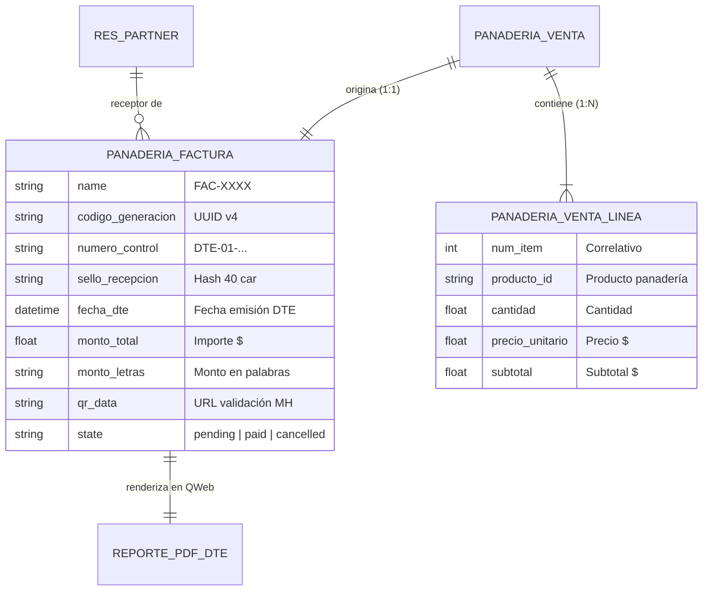

# Phase 1: Data Model — Facturación DTE y Generación PDF

**Feature**: `specs/4-invoicing/4.1-customer-invoices/4.1.2-dte-invoice-pdf-generation`  
**Date**: 2026-10-01  
**Status**: Complete

---

## 1. Extensiones del Modelo de Datos

### 1.1. Modelo `panaderia.factura` (Ampliación DTE)

| Campo | Tipo | Restricción / Propiedades | Descripción y Justificación |
| :--- | :--- | :--- | :--- |
| `codigo_generacion` | `Char` | `readonly=True, copy=False, index=True` | UUID v4 oficial en mayúsculas (36 caracteres) requerido por MH de El Salvador. |
| `numero_control` | `Char` | `readonly=True, copy=False, index=True` | Formato legal `DTE-01-M001P001-{correlativo:015d}`. |
| `sello_recepcion` | `Char` | `readonly=True, copy=False` | Hash fiscal de 40 caracteres representativo de recepción en Hacienda. |
| `modelo_facturacion` | `Char` | `default='Modelo Facturación previo', readonly=True` | Modelo de contingencia / previo según especificación DTE. |
| `tipo_transmision` | `Char` | `default='Transmisión normal', readonly=True` | Tipo de transmisión DTE. |
| `fecha_dte` | `Datetime` | `readonly=True, copy=False` | Timestamp exacto de emisión y generación DTE. |
| `monto_letras` | `Char` | `compute='_compute_monto_letras', store=True` | Representación en palabras en español (ej. *"SETENTA Y NUEVE CON 00/100 USD"*). |
| `qr_data` | `Text` | `compute='_compute_qr_data', store=True` | Payload codificado en el código QR para validación fiscal inmediata. |
| `condicion_operacion` | `Selection` | `[('contado', 'CONTADO'), ('credito', 'CRÉDITO')], default='contado', required=True` | Condición comercial para el bloque final del DTE. |
| `linea_ids` | `One2many` | `related='venta_id.linea_ids', readonly=True` | Acceso directo a las líneas de productos vendidos para el renderizado del PDF. |
| `subtotal_ventas` | `Float` | `compute='_compute_resumen_tributario', store=True` | Sumatoria bruta de ventas gravadas. |
| `iva_calculado` | `Float` | `compute='_compute_resumen_tributario', store=True` | IVA 13% incluido o desglosado según normativa DTE Factura. |

### 1.2. Extensiones en `res.partner` (Receptor Fiscal)

| Campo | Tipo | Restricción / Propiedades | Descripción |
| :--- | :--- | :--- | :--- |
| `dui` | `Char` | `copy=True, index=True` | Número de Documento Único de Identidad (ej. `06202964-6`). |
| `nit` | `Char` | `copy=True, index=True` | Número de Identificación Tributaria salvadoreño. |

### 1.3. Datos del Emisor (Panadería "Delicias Dulces")
Configuración corporativa registrada en `res.company` / contexto del módulo:
- **Nombre o Razón Social**: `DELICIAS DULCES S.A. DE C.V.` / `Panadería Delicias Dulces`
- **NIT**: `06140803841010`
- **NRC**: `1061224`
- **Actividad Económica**: `10711 - ELABORACIÓN DE PRODUCTOS DE PANADERÍA`
- **Dirección**: `Avenida Los Próceres #120, Local 4, San Salvador, El Salvador.`
- **Teléfono**: `2251-8241`
- **Correo Electrónico**: `ventas@deliciasdulces.sv`
- **Logotipo**: `Modulo_Odoo/static/src/img/logo_delicias_dulces.png`

---

## 2. Diagrama de Entidad-Relación y Flujo de Datos

---

## 3. Reglas de Negocio e Inmutabilidad

1. **Generación Determinista**: Una vez asignados `codigo_generacion`, `numero_control` y `sello_recepcion`, estos valores quedan bloqueados contra reescritura para cumplir con auditoría tributaria.
2. **Cálculo de Moneda a Letras**: El conversor procesa la parte entera en palabras en mayúsculas y la fracción como `CON {cents:02d}/100 USD`.
3. **Consumidor Final por Defecto**: Si el cliente no posee DUI/NIT registrado, el receptor se rotula como `"Consumidor Final"` con documento `"N/A"`, garantizando que el PDF siempre renderice sin errores.
