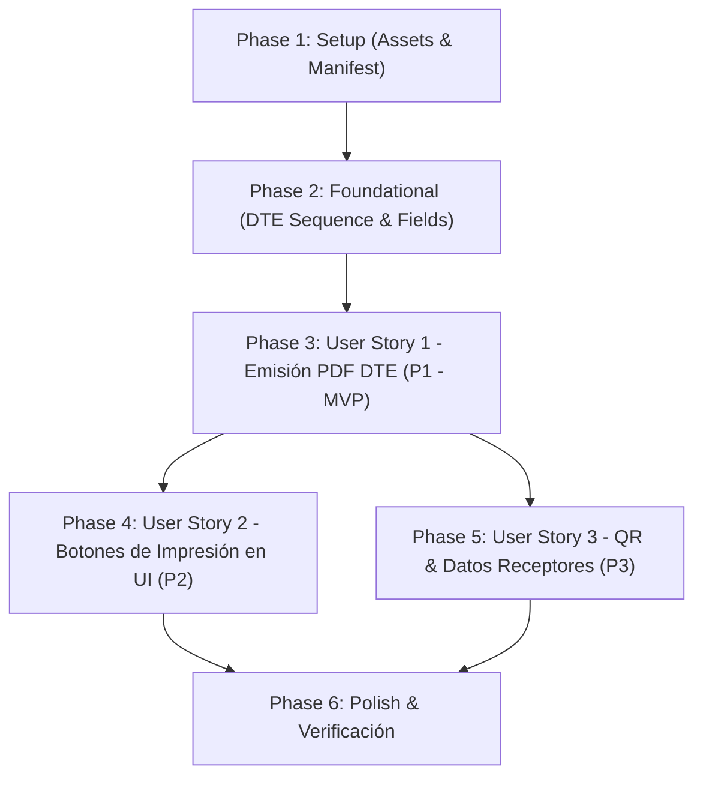

# Tasks: Generación de Factura PDF DTE El Salvador

**Feature**: `SPEC-4.1.2: Generación de Factura PDF con Estándar DTE de El Salvador`  
**Branch**: `4.1.2-dte-invoice-pdf-generation`  
**Spec**: [`specs/4-invoicing/4.1-customer-invoices/4.1.2-dte-invoice-pdf-generation/spec.md`](spec.md)  
**Plan**: [`specs/4-invoicing/4.1-customer-invoices/4.1.2-dte-invoice-pdf-generation/plan.md`](plan.md)  
**Data Model**: [`specs/4-invoicing/4.1-customer-invoices/4.1.2-dte-invoice-pdf-generation/data-model.md`](data-model.md)  
**Contracts**: [`specs/4-invoicing/4.1-customer-invoices/4.1.2-dte-invoice-pdf-generation/contracts/report-contract.md`](contracts/report-contract.md)  
**Quickstart**: [`specs/4-invoicing/4.1-customer-invoices/4.1.2-dte-invoice-pdf-generation/quickstart.md`](quickstart.md)  

---

## Phase 1: Setup (Assets & Manifest Registration)

**Purpose**: Register static assets, QWeb templates, and test imports required for DTE PDF generation.

- [X] T001 [P] Ensure bakery logo asset is correctly placed at `Modulo_Odoo/static/src/img/logo_delicias_dulces.png`
- [X] T002 Register report template `report/reporte_factura_dte_template.xml` in data list of `Modulo_Odoo/__manifest__.py`
- [X] T003 [P] Register test suite import `from . import test_factura_dte` in `Modulo_Odoo/tests/__init__.py`

---

## Phase 2: Foundational (DTE Sequence & Core Model Extensions)

**Purpose**: Establish DTE sequence numbering, fiscal customer fields, and core DTE attributes before implementing UI and printing logic.

**⚠️ CRITICAL**: PDF rendering and official tax identifiers require these model extensions.

- [X] T004 Define sequence record `seq_panaderia_factura_dte_control` in `Modulo_Odoo/data/factura_sequence.xml` with `code="panaderia.factura.dte.control"`, `prefix="DTE-01-M001P001-"`, and `padding="15"`
- [X] T005 [P] Add `dui` and `nit` fiscal fields to `res.partner` in `Modulo_Odoo/models/cliente.py`
- [X] T006 Add DTE fields (`codigo_generacion`, `numero_control`, `sello_recepcion`, `fecha_dte`, `modelo_facturacion`, `tipo_transmision`, `condicion_operacion`, `linea_ids`) to `panaderia.factura` in `Modulo_Odoo/models/factura.py`
- [X] T007 Implement deterministic amount-to-words converter in Spanish (`_monto_en_palabras`) and computed field `monto_letras` in `Modulo_Odoo/models/factura.py`
- [X] T008 Implement QR payload generator and computed field `qr_data` in `Modulo_Odoo/models/factura.py`

**Checkpoint**: Foundation ready — DTE attributes, sequence generator, and conversion helpers available. User story implementation can begin.

---

## Phase 3: User Story 1 - Emisión y Generación Automática del PDF de Factura DTE al Completar la Venta (Priority: P1) 🌟 MVP

**Goal**: Al confirmar una venta o crear una factura, generar automáticamente los identificadores DTE de El Salvador (UUID, Control, Sello) y renderizar el PDF oficial con el logotipo de Panadería Delicias Dulces, cuerpo de productos y totales fiscales.

**Independent Test**: Confirmar una orden de venta de mostrador con al menos 2 productos; verificar que la factura asociada adquiere automáticamente Código de Generación UUID, Número de Control DTE-01 y Sello de Recepción, y que la acción de reporte QWeb compila el archivo PDF mostrando el logotipo y los datos fiscales exactos.

### Tests for User Story 1 ⚠️

> **NOTE: Write these tests FIRST, ensure they FAIL before implementation**

- [X] T009 [P] [US1] Create automated unit tests for DTE identifiers generation, UUID v4 format, and PDF action execution in `Modulo_Odoo/tests/test_factura_dte.py`

### Implementation for User Story 1

- [X] T010 [US1] Update `create()` in `Modulo_Odoo/models/factura.py` to auto-generate `codigo_generacion` (canonical UUID v4 uppercase), `numero_control` (from sequence `panaderia.factura.dte.control`), `sello_recepcion` (40-char fiscal hash), and `fecha_dte`
- [X] T011 [US1] Declare QWeb report action `action_report_factura_dte` (`report_type="qweb-pdf"`, model `panaderia.factura`) in `Modulo_Odoo/report/reporte_factura_dte_template.xml`
- [X] T012 [US1] Implement QWeb template `reporte_factura_dte` in `Modulo_Odoo/report/reporte_factura_dte_template.xml` with header showing bakery logo (`/panaderia/static/src/img/logo_delicias_dulces.png`), Emisor details ("DELICIAS DULCES S.A. DE C.V."), title "DOCUMENTO TRIBUTARIO ELECTRÓNICO - FACTURA", and DTE metadata block
- [X] T013 [US1] Implement body table in `reporte_factura_dte` in `Modulo_Odoo/report/reporte_factura_dte_template.xml` iterating over `linea_ids` with columns N°, Cantidad, Unidad, Descripción, Precio Unitario, Descuentos, Ventas No Sujetas, Exentas y Gravadas
- [X] T014 [US1] Implement tax settlement summary, subtotal, IVA, total a pagar, and footer with "Valor en Letras" and "Condición de la Operación" in `Modulo_Odoo/report/reporte_factura_dte_template.xml`
- [X] T015 [US1] Implement method `action_print_factura_dte()` in `Modulo_Odoo/models/factura.py` returning the QWeb report action

**Checkpoint**: User Story 1 (MVP) is fully functional and testable independently. Invoices auto-generate DTE identifiers and produce the official PDF.

---

## Phase 4: User Story 2 - Descarga e Impresión Bajo Demanda del Comprobante PDF (Priority: P2)

**Goal**: Proveer botones accesibles en la interfaz de usuario tanto en el formulario de la factura como en la orden de venta para imprimir o descargar el comprobante PDF oficial DTE en cualquier momento.

**Independent Test**: Abrir una orden de venta confirmada o una factura previa y hacer clic en el botón "Imprimir Factura DTE"; comprobar que el sistema devuelve el archivo PDF de inmediato sin alterar ningún dato del registro.

### Implementation for User Story 2

- [X] T016 [US2] Add "Imprimir Factura DTE" button in `<header>` of form view in `Modulo_Odoo/views/factura_views.xml` calling `action_print_factura_dte`
- [X] T017 [US2] Add group "Datos Fiscales DTE (Hacienda El Salvador)" in `Modulo_Odoo/views/factura_views.xml` displaying `codigo_generacion`, `numero_control`, `sello_recepcion`, `fecha_dte` y `monto_letras`
- [X] T018 [US2] Implement method `action_print_factura_dte()` in `Modulo_Odoo/models/venta.py` validating associated invoice existence and delegating print action
- [X] T019 [US2] Add "Imprimir Factura DTE" button in `<header>` of form view in `Modulo_Odoo/views/venta_views.xml` visible when `factura_id` is set

**Checkpoint**: User Story 2 is complete. Both invoice and sales order views feature single-click DTE PDF generation and printing.

---

## Phase 5: User Story 3 - Visualización de Código QR, Monto en Letras y Datos Fiscales Receptores (Priority: P3)

**Goal**: Incluir el código QR bidimensional escaneable en el PDF, mostrar el desglose fiscal del receptor (o Consumidor Final) y garantizar la concordancia del monto en letras.

**Independent Test**: Escanear el código QR del PDF emitido para validar sus parámetros, verificar que clientes con DUI/NIT reflejan su información en la caja de Receptor y comprobar que clientes sin documento figuren como "Consumidor Final" sin generar advertencias.

### Implementation for User Story 3

- [X] T020 [US3] Integrate native QR code rendering tag `` into DTE block in `Modulo_Odoo/report/reporte_factura_dte_template.xml`
- [X] T021 [US3] Add fields `dui` and `nit` to the customer form view in `Modulo_Odoo/views/cliente_views.xml`
- [X] T022 [US3] Implement fallback logic in QWeb template `reporte_factura_dte` in `Modulo_Odoo/report/reporte_factura_dte_template.xml` to display "Consumidor Final" when receptor lacks tax ID

**Checkpoint**: User Story 3 is complete. QR validation, customer tax attributes, and fallback scenarios render reliably.

---

## Phase 6: Polish & Cross-Cutting Concerns

**Purpose**: Validation across the entire suite, documentation updates, and Docker verification.

- [X] T023 [P] Execute automated test suite inside Docker container with `docker compose exec -T web odoo -d panaderia_db -u panaderia --test-enable --test-tags=/panaderia --stop-after-init --http-port=8079`
- [X] T024 Execute end-to-end manual verification following `specs/4-invoicing/4.1-customer-invoices/4.1.2-dte-invoice-pdf-generation/quickstart.md`
- [X] T025 [P] Update `Documentacion_Express.md` and `docs/test-procedures/` with DTE invoice PDF instructions and screenshots

---

## Dependencies & Execution Order

### Phase Dependencies

- **Phase 1 (Setup)**: Can start immediately.
- **Phase 2 (Foundational)**: Depends on Phase 1; blocks all User Stories.
- **Phase 3 (User Story 1 - MVP)**: Depends on Phase 2; enables core PDF report generation.
- **Phase 4 (User Story 2)** & **Phase 5 (User Story 3)**: Depend on Phase 3 and can run in parallel.
- **Phase 6 (Polish)**: Runs after all User Stories are implemented.

### Parallel Opportunities

- **Setup Phase**: T001 and T003 can execute concurrently.
- **Foundational Phase**: T005 and T006 can execute in parallel across `cliente.py` and `factura.py`.
- **User Stories 2 & 3**: Once User Story 1 is done, UI button integration (T016–T019) and QR/Partner view additions (T020–T022) can proceed independently.

---

## Implementation Strategy

### MVP First (User Story 1 Only)
1. Complete **Phase 1: Setup** (T001 - T003).
2. Complete **Phase 2: Foundational** (T004 - T008).
3. Complete **Phase 3: User Story 1** (T009 - T015).
4. **VALIDATE MVP**: Confirm a sale, open the invoice, and generate the PDF to verify layout, logo, and DTE numbers.

### Incremental Delivery
1. Foundation + MVP (Phases 1-3) delivers functional DTE invoice PDF generation.
2. Add Phase 4 (US2) delivers ergonomic UI buttons on sales orders and invoices.
3. Add Phase 5 (US3) delivers QR barcode verification and partner tax fields.
4. Phase 6 validates tests and documentation.
