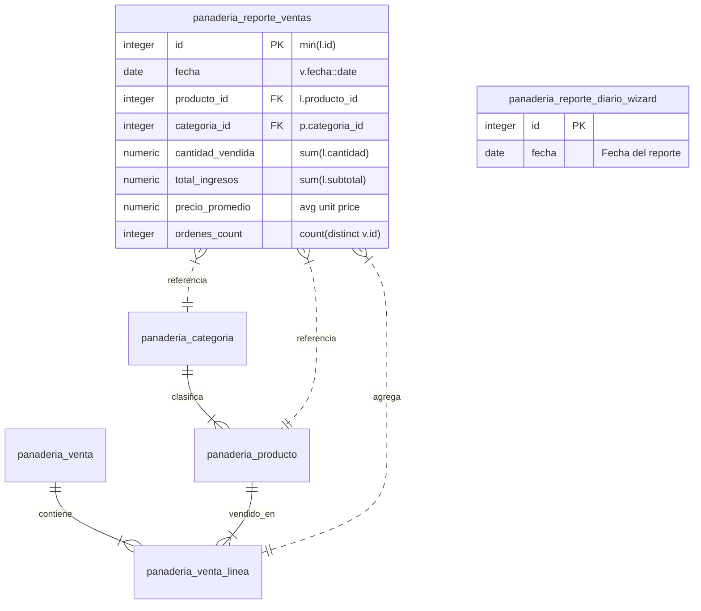

# Phase 1: Data Model Specification (SPEC-5.1.1)

## Feature: Reportes Operativos Diarios y Alertas de Stock
**Module**: `Modulo_Odoo`  
**Spec**: [`specs/5-reports/5.1-operational-reports/5.1.1-daily-sales-and-stock-reports/spec.md`](spec.md)

---

## 1. Relational Schema & Entity Definitions



---

## 2. Model: `panaderia.reporte.ventas` (SQL View)

| Field Name | Type | Constraints / Attributes | Description |
| :--- | :--- | :--- | :--- |
| `id` | Integer | PK, Readonly | Unique identifier derived from `min(panaderia_venta_linea.id)`. |
| `fecha` | Date | Readonly, Index | Date of confirmed sales orders (`fecha::date`). |
| `producto_id` | Many2one | `comodel_name='panaderia.producto'`, Readonly | Sold bakery product. |
| `categoria_id` | Many2one | `comodel_name='panaderia.categoria'`, Readonly | Category of the product. |
| `cantidad_vendida` | Float | Readonly, Digits (10, 2) | Aggregate quantity of pieces / units sold. |
| `total_ingresos` | Float | Readonly, Digits (10, 2) | Aggregate revenue in dollars ($). |
| `precio_promedio` | Float | Readonly, Digits (10, 2) | Computed average unit selling price. |
| `ordenes_count` | Integer | Readonly | Count of distinct confirmed sales orders. |

### SQL View Definition:
```sql
CREATE OR REPLACE VIEW panaderia_reporte_ventas AS (
    SELECT
        min(l.id) AS id,
        v.fecha::date AS fecha,
        l.producto_id AS producto_id,
        p.categoria_id AS categoria_id,
        sum(l.cantidad) AS cantidad_vendida,
        sum(l.subtotal) AS total_ingresos,
        CASE 
            WHEN sum(l.cantidad) > 0 THEN round((sum(l.subtotal) / sum(l.cantidad))::numeric, 2) 
            ELSE 0.0 
        END AS precio_promedio,
        count(DISTINCT v.id) AS ordenes_count
    FROM panaderia_venta_linea l
    JOIN panaderia_venta v ON l.venta_id = v.id
    JOIN panaderia_producto p ON l.producto_id = p.id
    WHERE v.state = 'confirmed'
    GROUP BY v.fecha::date, l.producto_id, p.categoria_id
);
```

---

## 3. Transient Model: `panaderia.reporte.diario.wizard`

| Field Name | Type | Default | Description |
| :--- | :--- | :--- | :--- |
| `fecha` | Date | `fields.Date.context_today` | Date filter for printing the daily operational PDF summary. |

---

## 4. QWeb Report Parser Structure: `report.Modulo_Odoo.reporte_diario_template`

Computes the following data dictionary:
- `fecha_reporte`: Selected date.
- `total_ingresos_dia`: Sum of `total` for confirmed sales on `fecha_reporte`.
- `total_ordenes_dia`: Count of confirmed sales orders on `fecha_reporte`.
- `total_unidades_dia`: Sum of units sold across all sales lines on `fecha_reporte`.
- `top_productos`: Recordset of `panaderia.reporte.ventas` sorted by `cantidad_vendida desc` limit 10.
- `productos_stock_bajo`: Active products where `alerta_stock_bajo = True`, sorted by critical level.
