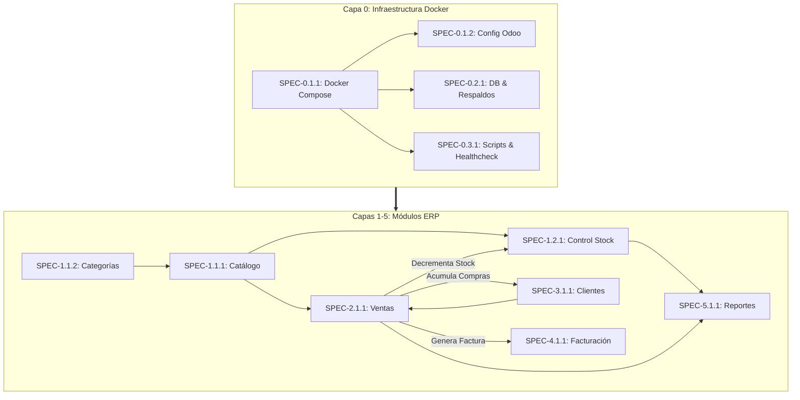

# Plan Maestro de Especificaciones (Spec Plan)
## Sistema ERP para Panadería "Delicias Dulces" — Desafío 3

Este documento define la descomposición jerárquica y el mapa de trazabilidad de especificaciones técnicas para el sistema ERP de la panadería "Delicias Dulces", estructurado bajo la metodología Spec-Driven Development (SDD) y alineado con los requerimientos académicos del Desafío 3.

---

## 1. Mapa de Especificaciones del Sistema

| Módulo | ID Spec | Título de la Especificación | Ruta del Archivo | Estado |
| :--- | :--- | :--- | :--- | :--- |
| **0. Infraestructura** | `SPEC-0.1.1` | Aprovisionamiento de Entorno Local en Docker | [`specs/0-infrastructure/0.1-docker-provisioning/0.1.1-local-docker-environment/spec.md`](specs/0-infrastructure/0.1-docker-provisioning/0.1.1-local-docker-environment/spec.md) | Implementado |
| **0. Infraestructura** | `SPEC-0.1.2` | Configuración del Servidor Odoo y Modos de Desarrollo | [`specs/0-infrastructure/0.1-docker-provisioning/0.1.2-odoo-server-configuration/spec.md`](specs/0-infrastructure/0.1-docker-provisioning/0.1.2-odoo-server-configuration/spec.md) | Implementado |
| **0. Infraestructura** | `SPEC-0.2.1` | Persistencia, Semillas y Respaldos PostgreSQL | [`specs/0-infrastructure/0.2-database-management/0.2.1-db-persistence-and-backups/spec.md`](specs/0-infrastructure/0.2-database-management/0.2.1-db-persistence-and-backups/spec.md) | Implementado |
| **0. Infraestructura** | `SPEC-0.3.1` | Automatización de Ciclo de Vida y Healthcheck | [`specs/0-infrastructure/0.3-developer-tooling/0.3.1-container-lifecycle-automation/spec.md`](specs/0-infrastructure/0.3-developer-tooling/0.3.1-container-lifecycle-automation/spec.md) | Implementado |
| **1. Inventario** | `SPEC-1.1.1` | Gestión de Catálogo de Productos | [`specs/1-inventory/1.1-product-catalog/1.1.1-product-management/spec.md`](file:///d:/UDB/CICLO-10-2026/DES/LAB/Desafio%203/des-panaderia-erp/specs/1-inventory/1.1-product-catalog/1.1.1-product-management/spec.md) | Listo |
| **1. Inventario** | `SPEC-1.1.2` | Categorías de Productos de Panadería | [`specs/1-inventory/1.1-product-catalog/1.1.2-product-categories/spec.md`](file:///d:/UDB/CICLO-10-2026/DES/LAB/Desafio%203/des-panaderia-erp/specs/1-inventory/1.1-product-catalog/1.1.2-product-categories/spec.md) | Listo |
| **1. Inventario** | `SPEC-1.2.1` | Control y Alerta de Stock Mínimo | [`specs/1-inventory/1.2-stock-control/1.2.1-stock-tracking/spec.md`](file:///d:/UDB/CICLO-10-2026/DES/LAB/Desafio%203/des-panaderia-erp/specs/1-inventory/1.2-stock-control/1.2.1-stock-tracking/spec.md) | Listo |
| **2. Ventas** | `SPEC-2.1.1` | Registro y Proceso de Ventas Esencial | [`specs/2-sales/2.1-sales-orders/2.1.1-order-management/spec.md`](file:///d:/UDB/CICLO-10-2026/DES/LAB/Desafio%203/des-panaderia-erp/specs/2-sales/2.1-sales-orders/2.1.1-order-management/spec.md) | Listo |
| **3. Clientes** | `SPEC-3.1.1` | Extensión y Registro de Clientes | [`specs/3-customers/3.1-partner-extension/3.1.1-bakery-customer-management/spec.md`](file:///d:/UDB/CICLO-10-2026/DES/LAB/Desafio%203/des-panaderia-erp/specs/3-customers/3.1-partner-extension/3.1.1-bakery-customer-management/spec.md) | Listo |
| **4. Facturación** | `SPEC-4.1.1` | Generación de Facturas Simples | [`specs/4-invoicing/4.1-customer-invoices/4.1.1-simple-invoice-generation/spec.md`](file:///d:/UDB/CICLO-10-2026/DES/LAB/Desafio%203/des-panaderia-erp/specs/4-invoicing/4.1-customer-invoices/4.1.1-simple-invoice-generation/spec.md) | Listo |
| **5. Reportes** | `SPEC-5.1.1` | Reportes Operativos Diarios y Alertas | [`specs/5-reports/5.1-operational-reports/5.1.1-daily-sales-and-stock-reports/spec.md`](file:///d:/UDB/CICLO-10-2026/DES/LAB/Desafio%203/des-panaderia-erp/specs/5-reports/5.1-operational-reports/5.1.1-daily-sales-and-stock-reports/spec.md) | Listo |

---

## 2. Dependencias e Interconexión entre Especificaciones

---

## 3. Convenciones de Desarrollo y Gobernanza

- Cada especificación sigue estrictamente la plantilla de 10 secciones estipulada en [.agents/rules/spec-guidelines.md](file:///d:/UDB/CICLO-10-2026/DES/LAB/Desafio%203/des-panaderia-erp/.agents/rules/spec-guidelines.md).
- Los procedimientos de prueba de interfaz manuales y automáticos se almacenan en `docs/test-procedures/test-procedure-X.Y.Z.md` vinculados 1:1 con cada SPEC.
- Todo desarrollo respeta la Constitución del Proyecto en [.specify/memory/constitution.md](file:///d:/UDB/CICLO-10-2026/DES/LAB/Desafio%203/des-panaderia-erp/.specify/memory/constitution.md).
